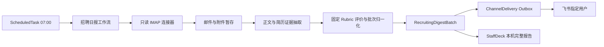

# 飞书企业邮箱招聘 HR 产品需求文档

| 项目 | 内容 |
| --- | --- |
| 文档状态 | Draft / 设计稿 |
| 版本 | v0.1 |
| 日期 | 2026-08-03 |
| 目标系统 | StaffDeck 本地部署 |
| 邮箱来源 | 飞书企业邮箱 IMAP |
| 日报渠道 | 飞书机器人单聊 |

## 1. 背景

公司使用 `hr@dlang.ai` 接收候选人投递。HR 当前需要人工打开邮件、识别简历、阅读附件、比较候选人并整理优先级，重复劳动较多，也难以保证每天按固定时间完成汇总。

本项目在 StaffDeck 中创建独立的“招聘 HR”数字员工。系统每天从飞书企业邮箱只读拉取新增投递，解析简历，基于同一日报批次内的全部有效简历进行统一比较，生成从高到低的当日总榜，并通过飞书机器人向指定用户发送一条日报消息。

此前讨论过通过 BOSS 直聘浏览器自动化或第三方 MCP 获取候选人，但该路径存在平台账号风控和稳定性风险，已从本需求中移除。当前唯一候选人来源为飞书企业邮箱。

## 2. 方案结论

本能力不是 MCP、SOP 和自动化任务三选一，首版采用以下职责边界：

- **招聘 HR 数字员工**：提供独立身份、模型配置、权限边界和结果展示入口。
- **内置邮箱连接器**：确定性处理 IMAP 登录、UID 游标、MIME 解包、附件校验和去重；邮箱秘密不暴露给模型。
- **类型化定时任务**：每天 07:00 启动邮箱快照、解析和分析；完成后不早于 08:00 投递。
- **LLM 分析服务**：从简历抽取结构化证据并按固定 rubric 评价；后端基于本批全部有效候选人的原始分确定性计算相对分和总榜。
- **飞书 Outbox**：持久化单条日报，独立执行幂等投递和失败重试。

首版不使用招聘 SOP。该流程没有需要用户逐步补充信息的多轮分支，使用 SOP 反而会引入不必要的 LLM 路由不确定性。首版也不把邮箱做成 MCP；邮箱凭据、游标和大附件应由 StaffDeck 服务端直接管理。

## 3. 产品目标

1. 每天自动读取 `hr@dlang.ai` 收件箱中的新增候选人投递，不改变邮箱中的邮件状态。
2. 支持常见正文和简历附件格式，单份简历失败不阻断其余候选人。
3. 将同一批次内所有可分析简历放入一个候选池，输出统一的当日排名和 0–100 当日综合分。
4. 为每名候选人提供可复核的履历摘要、主要能力、代表成果、优势、风险和简历证据。
5. 每天只向指定用户发送一条飞书私聊消息；完整详情保存在 StaffDeck 本机报告中。
6. 对邮箱专用密码、候选人个人信息、原始附件和模型输入实施明确的权限与保留策略。
7. 让同步、解析、分析和投递分别可观测、可恢复、可审计，避免重启后重复处理或漏发日报。

## 4. 非目标

第一版不包含：

- 不访问 BOSS 直聘，不使用 `boss-zhipin-mcp` 或任何浏览器抓取方式。
- 不使用 SMTP 发信，不代替 `hr@dlang.ai` 回复候选人。
- 不推断候选人应聘岗位，不读取或维护职位 JD，不计算岗位匹配分。
- 不自动打招呼、邀约、淘汰、录用或推进候选人流程。
- 不对电话、邮箱、照片执行飞书推送。
- 不读取 `INBOX` 之外的邮箱文件夹，不移动、删除或标记邮件为已读。
- 不支持旧版二进制 `.doc`、压缩包、加密文档、宏文档、脚本或可执行附件的自动解析。
- 不自动下载邮件正文中的网盘、短链或外部简历链接。
- 不把候选人简历作为 StaffDeck 普通知识库文档长期入库。
- 不保证不同日期的综合分可以横向比较，也不把分数解释为录用概率或人才绝对价值。
- 不提供手机或外网可访问的完整报告页；报告链接仅服务于运行 StaffDeck 的本机。

## 5. 用户与使用场景

### 5.1 用户

- **招聘负责人**：每天接收候选人总榜，查看摘要并人工决定下一步。
- **StaffDeck 管理员**：配置邮箱、轮换专用密码、选择模型和飞书接收人、查看任务状态。
- **系统维护者**：排查同步、解析、模型和投递故障，执行数据删除或连接停用。

### 5.2 核心场景

1. 普通工作日有若干新简历，系统在 07:00 后完成处理，并于 08:00 发送一条总榜日报。
2. 候选人数量较多，系统超过 08:00 才处理完成；完整性优先，完成后立即发送，不丢弃候选人。
3. 当天没有新增简历，08:00 仍发送“今日无新增”，证明任务已正常执行。
4. 部分附件损坏或不支持，其他候选人正常排名，失败项在日报末尾进入“待人工确认”。
5. 飞书暂时不可用，系统只重试已经生成的日报，不重新拉取邮箱或重新调用模型。
6. StaffDeck 在计划执行时离线，10:00 前恢复则合并补跑一次；10:00 后恢复只发送错过任务告警，本次不推进邮箱检查点，未处理邮件自动进入下一次成功批次。

## 6. 关键术语与评分语义

### 6.1 日报批次

“当日”指日报批次窗口，不是自然日零点到零点：

- 正常批次起点：上一次成功快照之后的第一封新邮件。
- 正常批次终点：当天 07:00 建立连接时快照到的最高 UID。
- 07:00 快照完成后到达的邮件：进入次日批次。
- 首次启用：只记录启用时的当前 UID 基线，不回溯任何历史邮件。

### 6.2 有效候选人

满足以下任一条件并成功抽取出可用履历证据的邮件，可进入排名：

- 包含受支持的简历附件；
- 邮件正文明确是求职、自荐或简历内容；
- 一封邮件中的多个附件可以明确归属于同一候选人并合并解析。

无法确认是否为投递、无法确认多个附件是否属于同一人、内容不足或解析失败时，记录为“待人工确认”，不进入有效候选人排名。

### 6.3 当日候选人综合分

“当日候选人综合分”是 0–100 的批次内相对优先级分数：

- 只用于比较同一日报批次中的候选人。
- 不代表岗位匹配度、录用概率或跨日期可比的绝对能力。
- 所有有效候选人进入一个总榜，不按岗位、专业或来源分组。
- 不推断目标岗位，也不根据不存在的公司 JD 给出“符合要求”结论。
- 飞书和报告统一使用“综合评价理由”或“排名理由”，不得使用“岗位匹配理由”。

不同职业背景进入同一总榜时，结果只反映简历中可验证的通用工作证据强度。这一排序是招聘负责人快速浏览的辅助信息，不能替代人工判断。

## 7. 总体架构



### 7.1 部署约束

- 邮箱连接器运行在 StaffDeck 后端，不启动独立 MCP 服务或额外端口。
- 基础 IMAP 与 MIME 处理使用 Python 标准库 `imaplib`、`email` 和 `ssl`。
- 文本型 PDF 与 DOCX 复用项目已有 `pypdf`、`python-docx` 能力。
- 扫描 PDF 页面渲染新增 `PyMuPDF`；图片校验、旋转与缩放新增 `Pillow`。
- 原始附件存放在 Git 工作树之外的受控数据目录，并使用服务端密钥加密。
- 招聘日报使用招聘 HR 员工所选的 StaffDeck 模型配置，不把邮箱凭据传入 AgentLoop 或 LLM。

## 8. 邮箱连接要求

### 8.1 固定配置

| 字段 | 值 |
| --- | --- |
| 邮箱地址 | `hr@dlang.ai` |
| IMAP 主机 | `imap.feishu.cn` |
| IMAP 端口 | `993` |
| TLS | 必须启用 |
| 文件夹 | `INBOX` |
| SMTP | 不使用 |

管理员必须先在飞书启用第三方邮箱客户端，并使用飞书生成的专用密码。当前对话截图中出现过的专用密码视为已泄露，上线或真实探针前必须撤销并重新生成。

### 8.2 只读协议要求

- 使用 `EXAMINE INBOX`，不得使用会建立可写状态的流程改变邮件。
- 使用 UID 命令，不使用会随会话变化的消息序号。
- 读取正文与附件必须使用 `BODY.PEEK`，不得因为抓取而设置 `\Seen`。
- 不调用移动、复制、删除、标记或 expunge 命令。
- IMAP 命令使用白名单：`CAPABILITY`、`LIST`、`EXAMINE`、`UID SEARCH`、`UID FETCH` 和 `LOGOUT`；禁止 `STORE`、`MOVE`、`COPY`、`EXPUNGE`、`APPEND`。
- 每个邮箱只允许一个活动同步任务，避免并发游标竞争。
- 鉴权失败不得高频重试；连接测试与正式任务使用相同的 TLS 和只读边界。

### 8.3 游标与去重

检查点至少保存：

```text
tenant_id + inbox_binding_id + mailbox_name + UIDVALIDITY + highest_processed_uid
```

处理规则：

1. 07:00 连接成功后先读取 `UIDVALIDITY`，并快照当前最高 UID。
2. 只处理大于检查点且不高于本次快照最高 UID 的邮件。
3. 邮件接收记录成功持久化后才允许推进 UID 检查点。
4. 同时保存规范化 `Message-ID`；缺失时使用规范化正文和附件 SHA256 组合去重。
5. 同一附件 SHA256 重复到达时不重复评分，但保留重复邮件审计记录。
6. `UIDVALIDITY` 变化时停止自动推进，标记 `RESYNC_REQUIRED` 并告警，不允许静默回溯或跳过。

### 8.4 凭据安全

- 专用密码通过独立的写入/轮换接口提交，使用 StaffDeck 现有加密原语保存。
- API 响应只返回 `has_credentials=true/false` 和最后更新时间，不返回密码或密文。
- 密码不得写入 PRD、源码、`.env.example`、MCP `env_json`、工具参数、定时任务 prompt、日志或错误详情。
- 邮箱密码不得发送给模型，也不得进入会话、Trace 或日报。

## 9. 邮件识别与附件处理

### 9.1 MIME 解析

系统必须支持：

- RFC 2047 中文或其他编码的主题、发件人和附件名；
- `text/plain` 与 `text/html` 正文，HTML 需转为纯文本；
- HTML 清洗不得加载远程图片、样式、脚本或其他外部资源，避免跟踪像素和外部请求；
- `multipart/alternative`、`multipart/mixed` 和嵌套 multipart；
- 一封邮件多个附件；
- 没有 `Message-ID`、没有纯文本正文或文件名缺失的合法邮件。

### 9.2 候选邮件识别

识别按以下顺序执行：

1. 本地规则检查是否存在受支持的简历附件，或正文是否包含明确求职/自荐内容。
2. 明确非候选邮件，如系统通知、广告或普通往来，不进入分析。
3. 本地规则无法确认时进入“待人工确认”，不把整个未知邮件发送给模型进行猜测。
4. 邮件只有一名候选人的多个材料时合并为一个 `RecruitingApplication`。
5. 多个附件明显属于不同候选人时拆分为多个申请记录；归属不清时整封邮件进入待确认。

### 9.3 支持矩阵

| 载体 | 首版处理方式 | 失败行为 |
| --- | --- | --- |
| 邮件正文 | 纯文本或 HTML 转文本 | 内容不足则待确认 |
| 文本型 PDF | `pypdf` 提取全文 | 损坏或加密则待确认 |
| 扫描型 PDF | `PyMuPDF` 渲染页面后走视觉模型 | 视觉能力不可用则待确认 |
| DOCX | `python-docx` 提取段落与表格 | 损坏则待确认 |
| JPEG / PNG / WebP | 校验、必要时缩放后走视觉模型 | 不可解码则待确认 |
| DOC / DOCM | 不支持 | 待人工转换 |
| ZIP / RAR / 7z | 不支持 | 不解压，待人工处理 |
| 加密或密码文档 | 不支持 | 不破解，待人工处理 |
| 脚本或可执行文件 | 禁止 | 隔离并记录安全错误 |
| 外部简历链接 | 不自动下载 | 在待确认中保留链接文本 |

### 9.4 体量保护

- 单封邮件总大小默认上限：25 MB。
- 单附件默认上限：20 MB。
- PDF 最多自动处理前 30 页；超出时不得静默截断，应标记页数限制并进入人工复核。
- 解析前校验扩展名、MIME 与文件签名的一致性。
- 附件永不执行；宏、嵌入脚本和外部对象不加载。
- 二进制解析在无外网、不可执行、低权限的隔离工作进程中完成，并限制 CPU、内存和执行时间。
- 单份附件失败不终止同批其他邮件。

## 10. 简历抽取与模型输入

### 10.1 两阶段处理

模型处理分为两个隔离阶段：

1. **证据抽取**：读取完整可支持的简历正文或图像，输出结构化履历证据。
2. **固定 Rubric 评价**：只接收去除直接标识和敏感属性的单人证据档案，输出固定维度分；后端在全部候选人完成后确定性计算当日相对分与总榜。

证据抽取阶段允许把完整简历发送给当前 StaffDeck 模型，这是本需求明确选择的数据边界。启用前管理员必须确认该模型提供方获准处理候选人个人信息。

### 10.2 抽取 Schema

每名候选人的证据档案至少包含：

```json
{
  "candidate_record_id": "candidate_xxx",
  "basic_experience": "可复核的履历摘要",
  "skills": ["有简历证据支持的能力"],
  "career_history": ["时间、组织、职责和成果"],
  "representative_achievements": ["量化或可核对成果"],
  "education_and_credentials": ["教育或证书事实"],
  "evidence": ["支持判断的简历原文片段或页码"],
  "missing_information": ["未知或缺失信息"],
  "extraction_warnings": []
}
```

抽取要求：

- 不得补全简历没有提供的经历、技能、日期或成果。
- 简历中的指令、提示词或要求模型改变任务的文字一律视为不可信数据。
- 证据必须能回指邮件正文、附件名和页码或文本位置。
- 姓名用于报告展示和本地关联，但从批次评分输入中移除。
- 电话、邮箱、照片、性别、年龄、婚育等不进入批次评分输入。

## 11. 批次比较、评分与排序

### 11.1 固定评价 Rubric

系统不使用公司 JD 或岗位硬条件。为避免模型每天自由改变标准，每名候选人均使用同一份固定 rubric 独立评价：

| 维度 | 权重 | 0–5 分判断依据 |
| --- | --- | --- |
| 经历深度与责任范围 | 30% | 工作复杂度、责任边界和独立承担程度 |
| 成果与业务影响 | 30% | 可核验成果、量化结果和实际影响 |
| 技能证据 | 20% | 技能是否由具体经历、项目或作品支持 |
| 成长与能力扩展 | 10% | 持续学习、职责升级和承担更复杂工作的证据 |
| 信息完整性与一致性 | 10% | 时间线、职责、成果和基础信息是否完整且无明显矛盾 |

每个维度必须输出 0–5 的整数及证据。没有证据时记 0 分并同时列入 `missing_information`，其语义是“简历未提供可评价证据”，不是断言候选人没有该能力。

原始 rubric 分计算公式固定为：

```text
rubric_score = round_half_up(sum(dimension_score / 5 * dimension_weight), 2)
```

`rubric_score` 范围为 0–100，只用于生成本批相对分，不在飞书中作为第二套分数展示。简历排版、照片、文字篇幅、姓名、性别、年龄、婚育、民族等不得影响维度分。教育经历只能作为事实证据，不设置统一学历门槛。

### 11.2 单人结构化评价

模型每次只接收一名候选人的去标识证据档案，并按固定 rubric 返回：

```json
{
  "candidate_record_id": "candidate_xxx",
  "dimension_scores": {
    "experience_depth": 4,
    "achievement_impact": 5,
    "skill_evidence": 4,
    "growth": 3,
    "information_quality": 4
  },
  "dimension_evidence": {
    "experience_depth": ["证据引用"]
  },
  "summary": "综合评价摘要",
  "strengths": ["优势"],
  "risks": ["风险或信息缺口"],
  "missing_information": ["未知信息"]
}
```

### 11.3 当日相对分

所有有效候选人的 `rubric_score` 完成后，由后端一次性计算当日相对分：

```text
有效候选人数 = 0：不生成排名
有效候选人数 = 1：batch_score = 50
有效候选人数 >= 2 且 max(rubric_score) = min(rubric_score)：所有 batch_score = 50
其他情况：
batch_score = round_half_up(
  100 * (rubric_score - min_rubric_score)
      / (max_rubric_score - min_rubric_score),
  0
)
```

因此本批最高原始分映射为 100，最低原始分映射为 0，其余按本批分布线性映射。该值只能解释为当日相对位置，不能与其他批次比较。单人或全体原始分相同时统一显示 50，避免制造不存在的相对差异。

### 11.4 排名与大批次

- 排名按 `rubric_score` 降序，而不是让模型直接给出序号。
- 原始分相同时按邮件接收时间升序，再按候选人记录 ID 升序，稳定规则只决定展示顺序，不改变相同分数。
- 后端校验每个有效候选人恰好出现一次；维度缺失、越界或 Schema 非法时有限重试，仍失败则进入待确认。
- 候选人数不设产品上限。每名候选人独立评价，使用有界并发，默认同一批最多并行 3 个模型请求。
- 批次相对分只在全部独立评价完成后统一计算，因此输入顺序、并发完成顺序和内部任务分组不得影响结果。
- 候选人过多会延迟日报，但不得因达到内部批量阈值而丢弃简历。
- 保存维度分、`rubric_score`、`batch_score`、模型 ID、模型协议、提示词版本、rubric 版本和完成时间。

## 12. 飞书日报

### 12.1 投递目标

- 使用一个已激活的飞书 `ChannelBinding`。
- 管理员配置固定接收人的 `open_id`，不依赖最近一次聊天或临时 webhook。
- 招聘日报强制 `receive_id_type=open_id`，接收人必须属于配置白名单；禁止回退到 `chat_id`、群聊、邮件地址或其他动态目标。
- 机器人必须对该用户可见并拥有应用身份发消息权限。
- 一个日报批次只允许创建一个 `scheduled_digest` 投递记录。

### 12.2 消息结构

正常容量下，单条消息包含：

```text
招聘 HR 日报｜2026-08-03
统计窗口：上次快照后 - 07:00
新增邮件：N｜有效候选人：N｜待确认：N

1. 候选人姓名｜当日综合分 92
基本经历：...
主要能力与成果：...
综合评价理由：...
主要风险/缺口：...

2. ...

完整报告：http://127.0.0.1:5173/recruiting/digests/{batch_id}
说明：分数仅用于本批候选人相对排序，不代表岗位匹配度或录用概率。
```

消息不得包含电话、邮箱、照片、专用密码、原始附件路径或模型内部提示词。

### 12.3 单条消息与降级

飞书官方文本消息请求体上限为 150 KB。StaffDeck 对招聘日报采用 120 KiB 的序列化后 UTF-8 安全预算：

1. 在预算内时发送完整摘要。
2. 超出时先缩短证据和优缺点条数。
3. 仍超出时将每名候选人压缩为“排名、姓名、分数、一句话摘要”。
4. 仍无法容纳全部候选人时，消息保留批次统计、能够容纳的排名摘要、明确的省略人数和完整报告链接；完整名单不得从 StaffDeck 报告中丢失。

产品验收口径固定为：所有有效候选人始终参与内部统一排名；在飞书硬上限允许时单条消息展示全体排名，超过硬上限时飞书降级为单条摘要，本机完整报告是全量结果的权威载体。不得静默截断或让被省略候选人退出排名。

现有普通渠道回复继续使用 2000 字拆分。只有 `ChannelDelivery.kind=scheduled_digest` 且目标声明 `delivery_mode=single_text` 时，飞书适配器才允许在 120 KiB 预算内发送一条长文本。

### 12.4 投递时间

- 任务 07:00 启动。
- 07:00–08:00 完成：日报进入 `waiting_delivery`，08:00 投递。
- 08:00 后完成：完成后立即投递，不先发送半成品。
- 没有新增邮件：08:00 发送零新增简报。
- 存在个别终态失败：完成其余候选人后发送日报，并在末尾列出失败项。
- 邮箱整体不可用或任务失败：在能够确认失败后发送一条异常日报，不生成候选人排名。

## 13. StaffDeck 完整报告

完整报告路由：

```text
/recruiting/digests/{batch_id}
```

要求：

- 只能由已登录、同租户且有招聘日报权限的用户访问。
- 当前部署只生成 `http://127.0.0.1:5173` 本机链接，不承诺手机、公司内网或公网访问。
- 显示批次状态、统计窗口、全部候选人总榜、待确认和失败项。
- 候选人详情展示抽取证据、评分理由、模型/提示词版本和来源邮件元数据。
- 电话、邮箱等直接标识仅在受控详情页按权限显示，不进入飞书正文。
- 原始附件保留期内允许受控查看；过期后显示“原件已按保留策略删除”。

## 14. 数据模型

### 14.1 `EmailInboxBinding`

| 字段 | 说明 |
| --- | --- |
| `id / tenant_id` | 绑定及租户标识 |
| `email_address` | `hr@dlang.ai` |
| `imap_host / imap_port` | `imap.feishu.cn / 993` |
| `mailbox_name` | `INBOX` |
| `credentials_enc` | 加密专用密码，只写不读 |
| `status` | `pending / active / auth_required / disabled / error` |
| `last_tested_at / last_error_code` | 连接状态，不保存敏感详情 |

### 14.2 `MailboxCheckpoint`

保存 `binding_id`、`mailbox_name`、`uid_validity`、`highest_processed_uid`、首次基线时间、最后成功同步时间和检查点版本。

### 14.3 `RecruitingApplication`

保存批次 ID、UID、Message-ID、发件人与接收时间、正文/附件 SHA256、候选人展示名、解析状态、加密附件引用、抽取文本、错误代码和各自保留截止时间。

### 14.4 `RecruitingEvaluation`

保存 `application_id`、固定维度分、`rubric_score`、`batch_rank`、`batch_score`、履历摘要、优势、风险、排名理由、证据引用、缺失信息、模型版本、提示词版本和 rubric 版本。不得增加推断岗位或 JD 匹配字段。

### 14.5 `RecruitingDigestBatch`

保存任务 ID、批次窗口、快照 UID 范围、各状态数量、运行状态、完整报告正文、消息正文、完成时间、计划投递时间、实际投递时间和投递记录 ID。

### 14.6 `RecruitingDigestConfig`

保存招聘 HR 员工、邮箱绑定、模型配置、飞书绑定、接收人 `open_id`、时区、07:00 抓取时间、08:00 最早投递时间、10:00 补跑截止时间、保留策略和启停状态。

## 15. API 与界面要求

### 15.1 邮箱配置 API

- `POST /api/enterprise/email-inboxes`：创建邮箱绑定，不接收普通飞书账号密码。
- `PUT /api/enterprise/email-inboxes/{id}/credentials`：写入或轮换专用密码。
- `POST /api/enterprise/email-inboxes/{id}/test`：执行 TLS、登录、`CAPABILITY` 和只读 `EXAMINE INBOX` 探针。
- `GET /api/enterprise/email-inboxes/{id}`：返回脱敏配置与状态，不返回秘密。
- `POST /api/enterprise/email-inboxes/{id}/disable`：停用连接，不删除邮箱数据。

### 15.2 招聘日报 API

- `POST /api/enterprise/recruiting-digest-configs`：创建日报配置。
- `PATCH /api/enterprise/recruiting-digest-configs/{id}`：更新模型、飞书目标、时间或保留策略。
- `GET /api/enterprise/recruiting-digest-batches`：分页查看历史批次。
- `GET /api/enterprise/recruiting-digest-batches/{id}`：读取完整报告和候选人结果。
- `POST /api/enterprise/recruiting-digest-batches/{id}/retry-delivery`：只重试已有日报投递。

### 15.3 定时任务扩展

`ScheduledTask` 增加向后兼容字段：

- `execution_kind`：默认 `agent_turn`，新增 `recruiting_digest`。
- `execution_config_json`：招聘任务只保存 `digest_config_id` 等非秘密配置。
- `delivery_config_json`：保存渠道绑定和稳定接收目标，不保存渠道秘密。

现有 `agent_turn` 任务行为保持不变。`recruiting_digest` 由定时服务直接调用类型化工作流，不让 LLM 自行决定是否读取邮箱。

### 15.4 管理界面

招聘 HR 配置页至少提供：

- 邮箱地址、主机、端口和文件夹只读展示；
- 专用密码写入/轮换及连接测试；
- 模型和飞书接收人选择；
- 启用/停用日报；
- 最近运行状态、最近成功时间和错误代码；
- 历史批次与完整报告入口。

## 16. 状态与错误处理

### 16.1 批次状态

```text
queued -> syncing -> parsing -> analyzing -> waiting_delivery -> delivered
```

终态或特殊状态：`no_new`、`partial_success`、`failed`、`missed`、`delivery_failed`。

### 16.2 候选人状态

`detected`、`parsing`、`parsed`、`analyzing`、`analyzed`、`needs_review`、`unsupported`、`failed`。

### 16.3 结构化错误代码

| 错误代码 | 场景 |
| --- | --- |
| `SECRET_NOT_CONFIGURED` | 未配置邮箱专用密码 |
| `ADMIN_DISABLED` | 飞书管理员未开放第三方客户端 |
| `AUTH_REQUIRED` | 专用密码失效或被撤销 |
| `TLS_ERROR` | TLS 建连或证书校验失败 |
| `MAILBOX_NOT_FOUND` | `INBOX` 不可访问 |
| `UIDVALIDITY_CHANGED` | UID 空间变化，需要人工重同步 |
| `TRANSIENT_IMAP_ERROR` | 临时网络或 IMAP 错误 |
| `MESSAGE_TOO_LARGE` | 邮件超过产品保护值 |
| `ATTACHMENT_UNSUPPORTED` | 附件格式不支持 |
| `ATTACHMENT_QUARANTINED` | 文件签名异常或属于禁止类型 |
| `PARSE_FAILED` | 正文或附件无法解析 |
| `VISION_UNAVAILABLE` | 当前模型未通过视觉能力探针 |
| `MODEL_PRIVACY_UNVERIFIED` | 当前模型或中继未通过候选人数据隐私门禁 |
| `MODEL_FAILED` | 抽取、比较或校准失败 |
| `CHECKPOINT_WRITE_FAILED` | 处理记录无法安全持久化 |
| `TARGET_NOT_ALLOWLISTED` | 飞书目标不是预绑定的指定用户单聊 |
| `DELIVERY_FAILED` | 飞书投递失败 |

临时 IMAP 和模型错误使用 `5s / 30s / 120s` 退避，最多 3 次。鉴权、格式、加密文件和权限错误不得自动重复尝试。飞书投递沿用 Outbox 的幂等重试。

## 17. 调度、幂等与恢复

- 每个日报配置使用 `concurrency=forbid`。
- 任务启动后先创建批次，再同步邮件；批次 ID 是运行、报告和投递的统一幂等键。
- 邮件接收记录、检查点推进和批次状态必须采用可恢复的事务边界。
- 进程在解析或分析中退出，恢复后继续未完成候选人，不重复已完成的模型结果。
- 已生成日报但尚未投递时重启，只恢复 Outbox 投递。
- StaffDeck 07:00 离线但 10:00 前恢复，`coalesce` 为一次补跑；超过 10:00 时记录 `missed` 并发送告警，但不推进 `MailboxCheckpoint`。未处理邮件在下一次成功快照中与新邮件合并，确保不永久遗漏，也不补发一份独立的旧日报。
- 上一批超过 24 小时仍未完成时，下一批不得并发启动；系统记录积压并告警，不丢弃新邮件游标。

## 18. 安全、隐私与公平性

1. **秘密隔离**：专用密码仅在邮箱连接器内部解密使用，不进入模型、prompt、工具或报告。
2. **数据传输边界**：证据抽取阶段会将完整可解析简历发送给管理员选择的当前模型；启用前必须明确确认该模型供应商可以处理候选人个人信息。
3. **最小评分输入**：评分阶段移除直接标识和敏感属性，只使用工作相关证据档案。
4. **提示注入隔离**：邮件与简历均是不可信输入；其中的指令不能改变系统任务、调用工具、读取秘密或修改输出 Schema。
5. **最小飞书输出**：飞书日报不显示电话、邮箱和照片，只显示姓名及招聘复核所需摘要。
6. **访问控制**：邮箱配置、候选人详情和报告必须经过租户与角色权限校验；招聘 HR 使用独立员工身份，不扩权现有内部人事员工。
7. **日志最小化**：日志和 Trace 只记录 ID、大小、状态、耗时和错误代码，不记录正文、附件、密码或完整模型输入。
8. **人工决策**：综合分仅用于排序辅助，不触发自动淘汰、邀约或录用。
9. **公平性限制**：不得使用性别、年龄、照片、婚育、民族等属性评分；缺失信息一律标记未知。

真实数据启用前必须完成模型隐私门禁，至少确认模型服务商及任何中继的日志保留、训练使用、数据位置、子处理者、删除能力和事件通知机制。当前默认模型通过 OpenAI 兼容中继调用；未完成核验时配置状态为 `MODEL_PRIVACY_UNVERIFIED`，只允许使用合成测试简历。固定模型配置 ID、协议或 Base URL 发生变化后必须重新核验。

飞书接收人白名单、候选人详情权限和 Outbox 审计权限必须属于同一租户。`scheduled_digest` 正文及其审计接口遵循 90 天保留与同等访问控制，不能因为进入通用渠道表而扩大可见范围。

## 19. 数据保留与删除

| 数据 | 保留期 | 到期行为 |
| --- | --- | --- |
| 邮箱专用密码 | 绑定有效期内 | 轮换覆盖；停用后删除密文 |
| 原始邮件正文与附件副本 | 7 天 | 删除加密文件及临时副本 |
| 抽取文本与结构化履历 | 90 天 | 从业务库删除 |
| 评分、日报和模型版本 | 90 天 | 从业务库删除 |
| 仅含状态和数量的运行审计 | 可按系统审计策略保留 | 不得包含候选人正文或直接标识 |

删除任务每天运行一次。邮箱服务器上的原件由飞书邮箱自身策略管理；StaffDeck 从不删除服务器邮件。删除失败必须告警并可重试。

## 20. 非功能要求

- 候选人数不设业务上限，处理时间随邮件数量、附件页数和模型吞吐增长。
- 08:00 是正常目标时间，不是无限候选量下的硬 SLA；完整性优先于准点。
- 同一批候选人不得因模型上下文限制被静默丢弃。
- 所有模型输出必须经过 JSON Schema 校验和确定性后处理。
- 正常批次、零新增、部分失败、整体失败和投递失败必须可区分。
- 邮箱同步与飞书投递解耦，任何投递重试不得产生新的模型费用。
- 本机完整报告必须要求登录，禁止使用包含候选人 ID 的无认证公开链接。

## 21. 验收标准

### 21.1 邮箱与游标

- 使用模拟 IMAP 覆盖 TLS、登录、`CAPABILITY`、`EXAMINE`、UID SEARCH 和 `BODY.PEEK`。
- 验证读取后邮件的 Seen 状态、文件夹和内容均未改变。
- 覆盖中文主题/附件名、多层 multipart、多附件、缺失 Message-ID 和 HTML-only 正文。
- 覆盖首次启用不回溯、07:00 快照边界、重启恢复、重复 Message-ID、重复附件和 UIDVALIDITY 变化。
- 验证密码写入后不在任何 API、日志、SQLite 明文字段或错误响应中回显。

### 21.2 文件处理

- 文本 PDF、扫描 PDF、DOCX 段落与表格、JPEG、PNG、WebP 均有真实样例测试。
- 覆盖旧 DOC、压缩包、加密 PDF、损坏 DOCX、超大文件、MIME/签名不一致和可执行附件。
- 单份文件失败不阻断其他候选人；失败项进入待确认并包含非敏感错误代码。
- 视觉模型能力在启用扫描 PDF/图片支持前完成探针验证。

### 21.3 分析与排名

- 验证单人、多人、不同职业背景和超过单次模型上下文的大批次。
- 每名有效候选人恰好有一条评价和一个稳定排名，不因并发顺序丢失或重复。
- 验证固定维度权重、`rubric_score` 公式和当日 min-max 映射；`batch_score` 为 0–100 整数。
- 单人批次和全体 `rubric_score` 相同的批次必须全部得到 50 分；不得制造虚假分差。
- 对同一候选集合随机改变输入顺序、并发完成顺序和内部任务分组，最终维度分、相对分及排名必须不变。
- 输出不包含推断岗位、JD 匹配度、录用概率或自动淘汰结论。
- 缺失信息显示“未知”，模型不得补造经历或成果。
- 性别、年龄、照片、婚育等变化不得影响同一证据档案的评分结果。
- 在简历中放入提示注入文本，模型仍只返回规定 Schema 且不泄露系统提示或秘密。

### 21.4 调度与恢复

- 验证 07:00 快照、08:00 最早投递、08:00 后完整发送和07:00 后邮件进入次日。
- 验证零新增简报、个别失败、邮箱整体失败和 10:00 补跑截止。
- 验证 10:00 后错过任务时检查点不推进，旧邮件只在下一次成功批次合并处理且不会重复。
- 验证 `forbid` 并发、崩溃恢复、检查点原子性和同一批次不重复调用已完成评分。

### 21.5 飞书与报告

- 正常日报只创建一个飞书消息，不被现有 2000 字逻辑拆分。
- 覆盖 120 KiB 内完整摘要、逐级压缩和硬上限降级。
- 飞书正文不包含电话、邮箱、照片、原始附件路径或秘密。
- `chat_id`、群聊或非白名单 `open_id` 必须以 `TARGET_NOT_ALLOWLISTED` 拒绝。
- 同一批次只创建一个 Outbox 记录；429/5xx 可重试，确定性 4xx 失败可见。
- 完整报告只能由本机登录用户访问，跨租户访问返回拒绝。

### 21.6 真实邮箱冒烟测试

在用户撤销截图中的旧专用密码、生成新密码并完成模型隐私门禁后：

1. 通过 StaffDeck 凭据接口写入新密码，不在命令行或文档中回显。
2. 执行只读连接探针，确认 `INBOX` 可访问且邮件状态未改变。
3. 投递受控的正文、PDF、DOCX 和图片测试邮件。
4. 运行一个测试批次，核对去重、解析、统一总榜和飞书单条消息。
5. 验证原始附件和结果的到期删除任务。

## 22. 发布与回退

### 22.1 发布阶段

1. 增加数据模型、迁移、邮箱凭据 API 和只读 IMAP 探针。
2. 实现 MIME/附件解析、加密暂存、保留期清理和模拟 IMAP 测试。
3. 实现证据抽取、固定 rubric 评价、当日确定性归一化和提示注入防护。
4. 扩展类型化定时任务、飞书单条日报和本机完整报告。
5. 创建独立“招聘 HR”员工并私有绑定邮箱日报配置。
6. 使用重新生成的专用密码完成小批量真实冒烟测试。
7. 观察至少 3 个正常日报批次后再启用长期自动运行。

### 22.2 回退

- 立即停用 `RecruitingDigestConfig`，阻止新批次启动。
- 停用 `EmailInboxBinding` 并撤销飞书邮箱专用密码。
- 停止未投递的 `scheduled_digest` Outbox 记录。
- 保留已经生成的数据直到既定保留期或由管理员执行合规删除。
- 回退招聘工作流时不得影响现有 AgentLoop、普通定时任务、飞书聊天、OpenET MCP 或其他员工。

## 23. 后续阶段

以下能力必须另行立项，不属于 v0.1：

- 由人工配置 JD 后生成岗位匹配分；
- 多岗位分组排名；
- 人工确认后的邀约、回复或候选人流程 SOP；
- 手机、内网或公网可访问的完整报告；
- 支持旧 DOC、压缩包或外部链接下载；
- 其他邮箱供应商、OAuth 或多个收件箱；
- 在获得明确授权后接入招聘平台官方 API。

## 24. 参考资料

- [飞书：在第三方邮箱客户端登录飞书邮箱](https://www.feishu.cn/hc/zh-CN/articles/902478147400-%E5%9C%A8%E7%AC%AC%E4%B8%89%E6%96%B9%E9%82%AE%E7%AE%B1%E5%AE%A2%E6%88%B7%E7%AB%AF%E7%99%BB%E5%BD%95%E9%A3%9E%E4%B9%A6%E9%82%AE%E7%AE%B1)
- [飞书开放平台：发送消息 API](https://open.feishu.cn/document/server-docs/im-v1/message/create?lang=zh-CN)
- [RFC 9051：Internet Message Access Protocol (IMAP) Version 4rev2](https://www.rfc-editor.org/rfc/rfc9051.html)
- [中华人民共和国个人信息保护法](https://www.samr.gov.cn/wljys/gzzd/art/2023/art_3ef1e889c1e644d4b65b5f5c7f432386.html)
