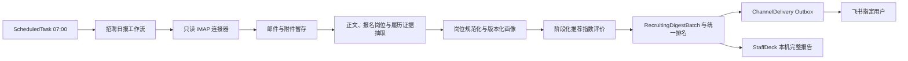

# 飞书企业邮箱招聘 HR 产品需求文档

| 项目 | 内容 |
| --- | --- |
| 文档状态 | Draft |
| 版本 | v0.3 |
| 日期 | 2026-08-06 |
| 目标系统 | StaffDeck 本地部署 |
| 邮箱来源 | 飞书企业邮箱 IMAP |
| 日报渠道 | 飞书机器人单聊 |

## 1. 背景

公司使用 `hr@dlang.ai` 接收候选人投递。HR 当前需要人工打开邮件、识别简历、阅读附件、比较候选人并整理优先级，重复劳动较多，也难以保证每天按固定时间完成汇总。

本项目在 StaffDeck 中创建独立的“招聘 HR”数字员工。系统每天从飞书企业邮箱只读拉取新增投递，解析简历和明确的报名岗位，为标准岗位生成或复用通用行业岗位画像，计算 0.0–10.0 的推荐指数，生成跨岗位统一总榜，并通过飞书机器人向指定用户发送一条日报消息。

此前讨论过通过 BOSS 直聘浏览器自动化或第三方 MCP 获取候选人，但该路径存在平台账号风控和稳定性风险，已从本需求中移除。当前唯一候选人来源为飞书企业邮箱。

## 2. 方案结论

本能力不是 MCP、SOP 和自动化任务三选一，首版采用以下职责边界：

- **招聘 HR 数字员工**：提供独立身份、模型配置、权限边界和结果展示入口。
- **内置邮箱连接器**：确定性处理 IMAP 登录、UID 游标、MIME 解包、附件校验和去重；邮箱秘密不暴露给模型。
- **类型化定时任务**：每天 07:00 启动邮箱快照、解析和分析；完成后不早于 08:00 投递。
- **LLM 分析服务**：从简历和邮件中抽取结构化履历证据及明确报名岗位，并根据版本化岗位画像生成分维度评价。
- **岗位画像缓存**：将报名岗位规范化为标准岗位，首次生成通用行业岗位画像并按版本复用，避免每日评分标准漂移。
- **确定性评分与排序**：后端按职业阶段权重计算 0.0–10.0 推荐指数，不做批次归一化，并生成跨岗位统一总榜。
- **飞书 Outbox**：持久化单条日报，独立执行幂等投递和失败重试。

首版不使用招聘 SOP。该流程没有需要用户逐步补充信息的多轮分支，使用 SOP 反而会引入不必要的 LLM 路由不确定性。首版也不把邮箱做成 MCP；邮箱凭据、游标和大附件应由 StaffDeck 服务端直接管理。

## 3. 产品目标

1. 每天自动读取 `hr@dlang.ai` 收件箱中的新增候选人投递，不改变邮箱中的邮件状态。
2. 支持常见正文和简历附件格式，单份简历失败不阻断其余候选人。
3. 识别候选人明确报名岗位，生成或复用对应的通用行业岗位画像，并输出 0.0–10.0 推荐指数。
4. 将所有可评分候选人放入跨岗位统一总榜，为每名候选人提供可复核的工作、项目、实习匹配证据、推荐理由、风险和信息缺口。
5. 每天只向指定用户发送一条飞书私聊消息；完整详情保存在 StaffDeck 本机报告中。
6. 对邮箱专用密码、候选人个人信息、原始附件和模型输入实施明确的权限与保留策略。
7. 让同步、解析、分析和投递分别可观测、可恢复、可审计，避免重启后重复处理或漏发日报。

## 4. 非目标

第一版不包含：

- 不访问 BOSS 直聘，不使用 `boss-zhipin-mcp` 或任何浏览器抓取方式。
- 不使用 SMTP 发信，不代替 `hr@dlang.ai` 回复候选人。
- 不根据历史任职名称、项目角色或模型猜测补造报名岗位；不抓取、配置或维护公司专属 JD。
- 不自动打招呼、邀约、淘汰、录用或推进候选人流程。
- 不对电话、邮箱、照片执行飞书推送。
- 不读取 `INBOX` 之外的邮箱文件夹，不移动、删除或标记邮件为已读。
- 不破解加密文档或加密压缩包，不执行宏、脚本、可执行文件、嵌入对象或外部链接；这些内容即使位于压缩包内也不得运行。
- 不自动下载邮件正文中的网盘、短链或外部简历链接。
- 不把候选人简历作为 StaffDeck 普通知识库文档长期入库。
- 不把推荐指数解释为公司 JD 匹配度、录用概率或候选人的绝对人才价值。
- 不提供手机或外网可访问的完整报告页；报告链接仅服务于运行 StaffDeck 的本机。

## 5. 用户与使用场景

### 5.1 用户

- **招聘负责人**：每天接收候选人总榜，查看摘要并人工决定下一步。
- **StaffDeck 管理员**：配置邮箱、轮换专用密码、选择模型和飞书接收人、查看任务状态。
- **系统维护者**：排查同步、解析、模型和投递故障，执行数据删除或连接停用。

### 5.2 核心场景

1. 普通工作日有若干新简历，系统在 07:00 后完成处理，并于 08:00 发送一条总榜日报。
2. 候选人数量较多，系统超过 08:00 才处理完成；完整性优先，完成后立即发送，不丢弃候选人。
3. 当天没有新增简历，08:00 仍发送“今日无新增”，证明任务已正常执行。
4. 部分附件损坏或不支持，其他候选人正常排名，失败项在日报末尾进入“待人工确认”。
5. 飞书暂时不可用，系统只重试已经生成的日报，不重新拉取邮箱或重新调用模型。
6. StaffDeck 在计划执行时离线，10:00 前恢复则合并补跑一次；10:00 后恢复只发送错过任务告警，本次不推进邮箱检查点，未处理邮件自动进入下一次成功批次。

## 6. 关键术语与评分语义

### 6.1 日报批次

“当日”指日报批次窗口，不是自然日零点到零点：

- 正常批次起点：上一次成功快照之后的第一封新邮件。
- 正常批次终点：当天 07:00 建立连接时快照到的最高 UID。
- 07:00 快照完成后到达的邮件：进入次日批次。
- 首次启用：只记录启用时的当前 UID 基线，不回溯任何历史邮件。

### 6.2 有效申请与可评分候选人

满足以下任一条件并成功抽取出可用履历证据的邮件，可建立有效申请：

- 包含受支持的简历附件；
- 邮件正文明确是求职、自荐或简历内容；
- 一封邮件中的多个附件可以明确归属于同一候选人并合并解析。

有效申请只有在明确识别出唯一报名岗位并成功取得岗位画像后，才成为可评分候选人并进入排名。无法确认是否为投递、无法确认多个附件是否属于同一人、内容不足、岗位缺失或歧义、岗位画像生成失败、简历解析失败时，记录为“待人工确认”，不生成推荐指数，也不进入排名。

### 6.3 推荐指数

“推荐指数”是 0.0–10.0 的岗位画像适配度：

- 只基于候选人明确报名岗位所生成的通用行业岗位画像，不使用公司专属 JD。
- 同一份证据、同一岗位画像版本、同一模型和提示词版本下，推荐指数不因同批其他候选人的增减而改变。
- 所有可评分候选人进入同一个跨岗位总榜，不按岗位、专业或来源分组，并在榜单中展示各自报名岗位。
- 推荐指数只用于每日人工处理优先级，不代表录用概率，也不触发自动淘汰、邀约或推进。
- 飞书和报告统一使用“推荐理由”“匹配证据”和“主要风险”，不得描述成公司 JD 匹配结论。

不同职业背景进入同一总榜时，推荐指数使用统一评分锚点，但所依据的岗位画像不同。该跨岗位排序只表示招聘负责人当天的复核优先级，不能解释为不同职业候选人的绝对价值比较。

## 7. 总体架构



### 7.1 部署约束

- 邮箱连接器运行在 StaffDeck 后端，不启动独立 MCP 服务或额外端口。
- 基础 IMAP 与 MIME 处理使用 Python 标准库 `imaplib`、`email` 和 `ssl`。
- 文本型 PDF 与 DOCX 复用项目已有 `pypdf`、`python-docx` 能力。
- 扫描 PDF 页面渲染新增 `PyMuPDF`；图片校验、旋转与缩放新增 `Pillow`。
- DOC/DOCM 自动转换使用本机已安装的 Microsoft Word，由 Windows 条件依赖 `pywin32` 驱动独立 COM 工作进程；不新增 LibreOffice 依赖。
- ZIP、RAR/RAR5 和 7z 统一通过 `RECRUITING_7Z_PATH` 指向的命令行程序处理；当前部署固定为 `E:\7-Zip\7z.exe` 26.02 x64，不把 7-Zip 二进制复制到仓库。
- 服务启动及启用招聘日报前必须探测 Word 转换能力，以及 7-Zip 的版本和 ZIP、RAR/RAR5、7z 格式能力；探测失败不得静默降级为“格式不支持”。
- 原始附件存放在 Git 工作树之外的受控数据目录，并使用服务端密钥加密。
- 招聘日报使用招聘 HR 员工所选的 StaffDeck 模型配置，不把邮箱凭据传入 AgentLoop 或 LLM。

## 8. 邮箱连接要求

### 8.1 固定配置

| 字段 | 值 |
| --- | --- |
| 邮箱地址 | `hr@dlang.ai` |
| IMAP 主机 | `imap.feishu.cn` |
| IMAP 端口 | `993` |
| TLS | 必须启用 |
| 文件夹 | `INBOX` |
| SMTP | 不使用 |

管理员必须先在飞书启用第三方邮箱客户端，并使用飞书生成的专用密码。当前对话截图中出现过的专用密码视为已泄露，上线或真实探针前必须撤销并重新生成。

### 8.2 只读协议要求

- 使用 `EXAMINE INBOX`，不得使用会建立可写状态的流程改变邮件。
- 使用 UID 命令，不使用会随会话变化的消息序号。
- 读取正文与附件必须使用 `BODY.PEEK`，不得因为抓取而设置 `\Seen`。
- 不调用移动、复制、删除、标记或 expunge 命令。
- IMAP 命令使用白名单：`CAPABILITY`、`LIST`、`EXAMINE`、`UID SEARCH`、`UID FETCH` 和 `LOGOUT`；禁止 `STORE`、`MOVE`、`COPY`、`EXPUNGE`、`APPEND`。
- 每个邮箱只允许一个活动同步任务，避免并发游标竞争。
- 鉴权失败不得高频重试；连接测试与正式任务使用相同的 TLS 和只读边界。

### 8.3 游标与去重

检查点至少保存：

```text
tenant_id + inbox_binding_id + mailbox_name + UIDVALIDITY + highest_processed_uid
```

处理规则：

1. 07:00 连接成功后先读取 `UIDVALIDITY`，并快照当前最高 UID。
2. 只处理大于检查点且不高于本次快照最高 UID 的邮件。
3. 邮件接收记录成功持久化后才允许推进 UID 检查点。
4. 同时保存规范化 `Message-ID`；缺失时使用规范化正文和附件 SHA256 组合去重。
5. 同一附件 SHA256 重复到达时不重复生成评价和推荐指数，但保留重复邮件审计记录。
6. `UIDVALIDITY` 变化时停止自动推进，标记 `RESYNC_REQUIRED` 并告警，不允许静默回溯或跳过。

### 8.4 凭据安全

- 专用密码通过独立的写入/轮换接口提交，使用 StaffDeck 现有加密原语保存。
- API 响应只返回 `has_credentials=true/false` 和最后更新时间，不返回密码或密文。
- 密码不得写入 PRD、源码、`.env.example`、MCP `env_json`、工具参数、定时任务 prompt、日志或错误详情。
- 邮箱密码不得发送给模型，也不得进入会话、Trace 或日报。

## 9. 邮件识别与附件处理

### 9.1 MIME 解析

系统必须支持：

- RFC 2047 中文或其他编码的主题、发件人和附件名；
- `text/plain` 与 `text/html` 正文，HTML 需转为纯文本；
- HTML 清洗不得加载远程图片、样式、脚本或其他外部资源，避免跟踪像素和外部请求；
- `multipart/alternative`、`multipart/mixed` 和嵌套 multipart；
- 一封邮件多个附件；
- 没有 `Message-ID`、没有纯文本正文或文件名缺失的合法邮件。

### 9.2 候选邮件识别

识别按以下顺序执行：

1. 本地规则检查是否存在受支持的简历附件，或正文是否包含明确求职/自荐内容。
2. 明确非候选邮件，如系统通知、广告或普通往来，不进入分析。
3. 本地规则无法确认时进入“待人工确认”，不把整个未知邮件发送给模型进行猜测。
4. 邮件只有一名候选人的多个材料时合并为一个 `RecruitingApplication`。
5. 多个附件明显属于不同候选人时拆分为多个申请记录；归属不清时整封邮件进入待确认。

### 9.3 报名岗位识别

报名岗位只能来自本次申请中的明确表述。系统先收集带来源和证据位置的岗位候选项，再按以下规则解析：

1. 从简历中的“应聘岗位”“申请职位”“求职意向”“目标岗位”等明确字段收集候选项。
2. 同时从邮件主题和正文中的“应聘”“申请”“投递”等明确表述收集候选项。
3. 简历只有一个唯一规范化岗位时使用该岗位；邮件出现不同岗位时仍以简历为准，并保存 `JOB_TITLE_CONFLICT` 警告及全部冲突原文。
4. 简历包含多个不同的规范化岗位时，标记 `JOB_TITLE_AMBIGUOUS`，不得使用邮件替候选人选择其中一个岗位。
5. 简历没有岗位时合并检查邮件主题和正文；规范化后只有一个唯一岗位时使用该岗位，存在多个不同岗位时标记 `JOB_TITLE_AMBIGUOUS`。
6. 简历和邮件均没有明确岗位时，标记 `JOB_TITLE_MISSING`。

不得把候选人的历史任职名称、项目角色、专业名称或技能关键词当作本次报名岗位。岗位缺失或歧义时不得让模型猜测，也不得生成推荐指数。

### 9.4 支持矩阵

| 载体 | 首版处理方式 | 失败行为 |
| --- | --- | --- |
| 邮件正文 | 纯文本或 HTML 转文本 | 内容不足则待确认 |
| 文本型 PDF | `pypdf` 提取全文 | 损坏或加密则待确认 |
| 扫描型 PDF | `PyMuPDF` 渲染页面后走视觉模型 | 视觉能力不可用则待确认 |
| DOCX | `python-docx` 提取段落与表格 | 损坏则待确认 |
| JPEG / PNG / WebP | 校验、必要时缩放后走视觉模型 | 不可解码则待确认 |
| DOC / DOCM | Word 独立 COM 进程自动转换为无宏 DOCX，再用 `python-docx` 解析 | 转换器不可用、加密、损坏或转换失败则待确认 |
| ZIP / RAR / RAR5 / 7z | 7-Zip 先列清单并校验，再逐条安全流式提取受支持文件 | 加密、危险条目、归属不清或超限则待确认 |
| 加密或密码文档/压缩包 | 不支持 | 不猜测或破解密码，待人工处理 |
| 脚本或可执行文件 | 禁止 | 隔离并记录安全错误 |
| 外部简历链接 | 不自动下载 | 在待确认中保留链接文本 |

### 9.5 自动转换与安全解包

DOC/DOCM 转换规则：

1. 校验扩展名、MIME 和文件签名后，将源文件复制到任务专用隔离目录，再交给独立 Word COM 工作进程。
2. Word 使用 `AutomationSecurity=ForceDisable`、只读打开、`DisplayAlerts=0`、不更新外部链接、不加入最近文档且界面不可见；主后端进程不得直接持有 COM 实例。
3. 转换结果固定为无宏 DOCX。系统必须检查 OOXML 包中不存在 `vbaProject`、宏内容类型或宏关系，再校验文件签名和 SHA256，最后进入现有 DOCX 解析链。
4. 单文件转换最长 60 秒。超时后终止专用工作进程及其子进程；进程异常、输出为空或宏移除校验失败时标记 `DOCUMENT_CONVERSION_FAILED`。
5. 保存源文件 SHA256、派生 DOCX SHA256、Word 版本、转换耗时和状态；原 DOC/DOCM 永不直接执行。

压缩包处理规则：

1. 使用 `7z l -slt` 读取技术清单并使用 `7z t` 校验完整性，关闭标准输入，禁止任何交互式密码提示。
2. 拒绝绝对路径、`..` 路径穿越、NTFS Alternate Data Streams、符号链接、硬链接、设备文件、文件名解码失败和 MIME/签名不一致的条目。
3. 对通过校验的条目逐一使用标准输出流读取，由 StaffDeck 写入系统生成的随机文件名；不得让压缩包提供目标文件路径。
4. 只提取 DOC、DOCM、DOCX、PDF、JPEG、PNG、WebP 和允许的嵌套压缩包；脚本、可执行文件和其他禁止类型隔离并记录。
5. 最多递归处理 2 层压缩包；每个压缩包最多 100 个条目，单个展开文件不超过 20 MB，全部展开内容不超过 100 MB，单条目和总体压缩比均不得超过 100:1。
6. 加密包即使邮件正文包含疑似密码也不自动尝试，统一标记 `ARCHIVE_ENCRYPTED`。
7. 包内多份材料明显属于同一候选人时合并；明确属于不同候选人时拆分申请；仅凭目录或文件名仍无法归属时整包进入待确认。
8. 转换和解包产生的明文临时文件仅存在于任务专用隔离目录，解析完成或失败后立即删除；需保留的派生文件必须加密并沿用 7 天保留期。

### 9.6 体量保护

- 单封邮件总大小默认上限：25 MB。
- 单附件默认上限：20 MB。
- PDF 最多自动处理前 30 页；超出时不得静默截断，应标记页数限制并进入人工复核。
- 解析前校验扩展名、MIME 与文件签名的一致性。
- 附件永不执行；宏、嵌入脚本和外部对象不加载。
- 二进制解析在无外网、不可执行、低权限的隔离工作进程中完成，并限制 CPU、内存和执行时间。
- 单个压缩包处理总时限默认 60 秒；达到文件数、展开大小、压缩比、嵌套深度或时限任一限制时立即停止该压缩包，不影响同批其他申请。
- 单份附件失败不终止同批其他邮件。

## 10. 简历抽取与模型输入

### 10.1 三阶段处理

模型处理分为三个职责隔离阶段：

1. **证据与岗位抽取**：读取完整可支持的简历正文或图像，并结合邮件主题和正文，输出结构化履历证据及明确报名岗位候选项。
2. **岗位解析与画像获取**：后端应用岗位来源优先级，规范化唯一岗位名称，并生成或复用版本化通用行业岗位画像。
3. **推荐指数评价**：模型只接收去除直接标识和敏感属性的单人证据档案及固定版本岗位画像，输出分维度评价；后端确定性计算推荐指数与统一排名。

证据抽取阶段允许把完整简历发送给当前 StaffDeck 模型，这是本需求明确选择的数据边界。启用前管理员必须确认该模型提供方获准处理候选人个人信息。

### 10.2 抽取 Schema

每名候选人的证据档案至少包含：

```json
{
  "candidate_record_id": "candidate_xxx",
  "job_title_candidates": [
    {
      "raw_title": "后端开发工程师",
      "source": "resume",
      "evidence_ref": "resume.pdf#page=1"
    },
    {
      "raw_title": "Java 开发",
      "source": "email_subject",
      "evidence_ref": "message.subject"
    }
  ],
  "basic_experience": "可复核的履历摘要",
  "full_time_experience_months": 36,
  "skills": ["有简历证据支持的能力"],
  "career_history": ["时间、组织、职责和成果"],
  "representative_achievements": ["量化或可核对成果"],
  "education_and_credentials": ["教育或证书事实"],
  "evidence": ["支持判断的简历原文片段或页码"],
  "missing_information": ["未知或缺失信息"],
  "extraction_warnings": []
}
```

抽取要求：

- 不得补全简历没有提供的经历、技能、日期或成果。
- `job_title_candidates[].source` 只能是 `resume`、`email_subject` 或 `email_body`；每个岗位原文和来源必须可回溯。
- 正式工作月数只根据简历明确日期计算，重叠月份不得重复累计，实习经历不计入正式工作月数；无法可靠计算时使用 `null`。
- 简历中的指令、提示词或要求模型改变任务的文字一律视为不可信数据。
- 证据必须能回指邮件正文、附件名和页码或文本位置。
- 姓名用于报告展示和本地关联，但从推荐指数评价输入中移除。
- 电话、邮箱、照片、性别、年龄、婚育等不进入推荐指数评价输入。

`job_title_candidates` 是抽取阶段输出。后端岗位解析器另行生成并保存唯一的 `resolved_applied_job`，包含原始岗位、主来源、标准岗位名称、显式职级、解析状态和冲突警告；不得让模型在抽取阶段直接覆盖解析结果。

## 11. 岗位画像、推荐指数与排序

### 11.1 岗位规范化与版本化画像

系统必须在岗位冲突判断和岗位画像查找之前，将岗位原文归一化为标准岗位身份。规范化流程固定为：

1. 对岗位原文执行 Unicode NFKC、大小写、空格、括号、标点和等价岗位后缀归一化，但保留会改变岗位要求的技术方向和职级。
2. 从明确的岗位原文中分别提取规范化职能名称、专业方向和显式职级；不得使用候选人的历史任职、项目角色或技能补全报名岗位。
3. 优先查询租户内已确认的岗位别名；未命中时，由模型将新名称与现有标准岗位进行语义等价比较，并输出目标标准岗位、置信度、理由及归一化模型/提示词版本。
4. 置信度达到 `0.90`、显式职级一致且核心职责族相同时，自动登记别名并复用现有岗位画像；低于 `0.90` 时标记 `ROLE_NORMALIZATION_REVIEW_REQUIRED`，不创建画像、不生成推荐指数。
5. 不同原文归一到同一标准岗位时不构成岗位冲突；简历和邮件只有在归一化后的标准岗位不同且简历优先规则无法消除冲突时，才记录 `JOB_TITLE_CONFLICT` 或 `JOB_TITLE_AMBIGUOUS`。

以下名称应归入同一标准岗位：`Java后端开发工程师`、`后端开发工程师（Java）`、`JAVA 后端工程师`。以下名称不得合并：`高级后端开发` 与 `后端开发实习生`、`产品经理` 与 `项目经理`。岗位名称过于宽泛但归一化结果明确时，可以创建宽泛画像并设置低特异性警告；“宽泛”与“无法确定归属”是不同状态。

标准岗位键由“规范化职能名称 + 专业方向 + 显式职级”组成。显式职级取值为 `campus / junior / experienced / unspecified`；技术方向为空时使用稳定空值，不得省略键位。首次遇到新的标准岗位键时，由模型生成一份通用行业岗位画像；后续评价复用当前有效版本，不得每个批次重新生成。岗位画像至少包含：

- 标准岗位名称，以及包含原始名称、来源、归一化置信度、确认方式和创建版本的别名记录；
- 通用典型职责、带稳定 ID 和 `is_critical` 标记的核心能力、显式职级；
- 工作经历、项目经验和实习经历中常见的有效匹配证据；
- 画像特异性提示、模型版本、提示词版本和画像 Schema 版本。

岗位画像不得包含公司专属要求，也不得包含性别、年龄、照片、婚育、民族等敏感属性要求。缓存键及数据库唯一约束至少包含租户、规范化职能名称、专业方向、显式职级和画像 Schema 版本；标题未声明职级时使用 `unspecified`，不得因不同候选人的工作年限创建不同画像。每个画像版本一经用于评价即不可变。新增别名不得重新生成画像；管理员显式重新生成时必须创建新版本，历史评价继续引用原版本。

岗位名称过于宽泛时仍生成宽泛画像并设置 `ROLE_PROFILE_LOW_SPECIFICITY` 警告；画像无法可靠生成或 Schema 校验失败时标记 `ROLE_PROFILE_GENERATION_FAILED`，对应候选人进入待人工确认且不评分。

### 11.2 评价阶段与维度权重

每个维度输出 0.0–10.0 的一位小数及对应证据：

| 维度 | 判断依据 |
| --- | --- |
| 相关工作经历 | 与岗位职责相关的正式工作内容、责任范围、复杂度、持续时间和成果 |
| 相关项目经验 | 项目与岗位能力的相关性、本人角色、所有权、复杂度和结果 |
| 相关实习经历 | 实习与岗位的相关性、真实职责、参与深度和结果 |
| 其他支持证据 | 有证据支持的技能、教育、证书及履历完整性；不得设置通用学历门槛 |

岗位名称明确包含阶段词时，以解析后的显式职级为准：`实习/校招/应届` 使用校园/起步期，`初级/助理` 使用初级期，`高级/资深/专家/负责人/经理/总监` 使用经验期。显式职级为 `unspecified` 时，按不重复累计的正式工作月数选择；不足 12 个月为校园/起步期，12–35 个月为初级期，36 个月及以上为经验期。工作月数无法可靠计算时使用初级期，并记录 `evaluation_stage_warning`。

| 评价阶段 | 工作经历 | 项目经验 | 实习经历 | 其他证据 |
| --- | ---: | ---: | ---: | ---: |
| 校园/起步期 | 10% | 40% | 40% | 10% |
| 初级期 | 40% | 35% | 15% | 10% |
| 经验期 | 55% | 35% | 0% | 10% |

经验期候选人的实习经历仍可抽取和展示，但缺少实习不扣分。没有某个加权维度的简历证据时，该维度记 0 分并列入 `missing_information`，其语义是“简历未提供可评价证据”，不得断言候选人没有该能力。

### 11.3 单人评价与推荐指数

模型每次只接收一名候选人的去标识证据档案和固定版本岗位画像，并返回：

```json
{
  "candidate_record_id": "candidate_xxx",
  "role_profile_id": "role_profile_xxx",
  "role_profile_version": 1,
  "evaluation_stage": "experienced",
  "dimension_scores": {
    "relevant_work_experience": 8.6,
    "relevant_project_experience": 8.2,
    "relevant_internship_experience": 0.0,
    "other_supporting_evidence": 7.5
  },
  "match_evidence": {
    "relevant_work_experience": ["证据引用"],
    "relevant_project_experience": ["证据引用"],
    "relevant_internship_experience": [],
    "other_supporting_evidence": ["证据引用"]
  },
  "core_capability_assessments": [
    {
      "capability_id": "capability_backend_01",
      "status": "supported",
      "evidence": ["证据引用"]
    }
  ],
  "recommendation_reasons": ["推荐理由"],
  "risks": ["主要风险或信息缺口"],
  "missing_information": ["未知信息"]
}
```

`core_capability_assessments` 必须对岗位画像中的每个核心能力 ID 恰好输出一次，状态枚举为 `strong / supported / partial / missing_evidence / contradicted`。缺项、重复项或未知能力 ID 均视为 Schema 非法并触发有限重试。后端将 `is_critical=true` 且状态为 `missing_evidence` 或 `contradicted` 的项目确定性汇总为 `critical_gaps`，而不是依赖模型自行声明是否存在重大缺口。

后端校验维度范围、四个维度的证据字段和逐项核心能力评价，并确定性计算：

```text
major_experience_subtotal =
  work_score * work_weight
  + project_score * project_weight
  + internship_score * internship_weight

recommendation_index = round_half_up(
  major_experience_subtotal
  + other_supporting_score * other_supporting_weight,
  1
)
```

权重使用小数值，例如 55% 按 `0.55` 参与计算。推荐指数不进行 min-max、分位数或其他批次归一化。评分锚点固定为：

- `0.0–2.9`：基本不匹配；
- `3.0–5.9`：匹配有限；
- `6.0–7.9`：基本匹配；
- `8.0–8.9`：明确推荐；
- `9.0–10.0`：极强匹配。

推荐指数达到 9.0 及以上必须同时满足：后端汇总的 `critical_gaps` 为空，并至少有两处具体、可回溯的职责或成果证据。公式结果达到 9.0 但不满足门槛时，后端将最终值封顶为 8.9。简历排版、照片、文字篇幅、姓名、性别、年龄、婚育、民族等不得影响维度分。

### 11.4 排名与大批次

- 所有岗位的可评分候选人进入同一个总榜，按 `recommendation_index` 降序排列，并展示各自报名岗位。
- 推荐指数相同时，依次按未四舍五入的 `major_experience_subtotal` 降序、邮件接收时间升序、候选人记录 ID 升序确定稳定顺序；稳定规则不改变相同推荐指数。
- 后端校验每个可评分候选人恰好出现一次；维度缺失、越界或 Schema 非法时有限重试，仍失败则进入待确认。
- 单人批次仍输出排名 1 和推荐指数，并明确注明当天没有其他横向比较样本。
- 岗位缺失、岗位歧义、岗位画像失败或简历解析失败的申请不生成推荐指数，也不占用排名序号。
- 候选人数不设产品上限。每名候选人独立评价，使用有界并发，默认同一批最多并行 3 个模型请求。
- 同一标准岗位的画像生成使用并发锁，避免首次遇到时产生多个不同版本；评价结果不得受输入顺序、并发完成顺序或内部任务分组影响。
- 同一份候选人证据在相同岗位画像、模型和提示词版本下，其推荐指数不得因同批其他候选人的增加或删除而改变。
- 候选人过多会延迟日报，但不得因达到内部批量阈值而丢弃简历。
- 跨岗位总榜仅用于每日人工复核优先级，不能解释为不同职业候选人的绝对价值比较。
- 保存实际权重、维度分、`major_experience_subtotal`、`recommendation_index`、`batch_rank`、岗位画像 ID/版本、模型 ID、模型协议、提示词版本和完成时间。

## 12. 飞书日报

### 12.1 投递目标

- 使用一个已激活的飞书 `ChannelBinding`。
- 管理员配置固定接收人的 `open_id`，不依赖最近一次聊天或临时 webhook。
- 招聘日报强制 `receive_id_type=open_id`，接收人必须属于配置白名单；禁止回退到 `chat_id`、群聊、邮件地址或其他动态目标。
- 机器人必须对该用户可见并拥有应用身份发消息权限。
- 一个日报批次只允许创建一个 `scheduled_digest` 投递记录。

### 12.2 消息结构

正常容量下，单条消息包含：

```text
招聘 HR 日报｜2026-08-05
统计窗口：上次快照后 - 07:00
新增邮件：N｜可评分候选人：N｜待确认：N

1. 候选人姓名｜报名岗位：后端开发工程师｜推荐指数：8.6/10
相关工作经历：...
相关项目经验：...
相关实习经历：...
推荐理由：...
主要风险/缺口：...

2. ...

待人工确认：
- 候选人记录｜JOB_TITLE_MISSING｜未生成推荐指数

完整报告：http://127.0.0.1:5173/recruiting/digests/{batch_id}
说明：推荐指数基于报名岗位名称生成的通用行业岗位画像，仅用于人工复核优先级，不代表公司 JD 匹配度或录用概率。
```

消息不得包含电话、邮箱、照片、专用密码、原始附件路径或模型内部提示词。

### 12.3 单条消息与降级

飞书官方文本消息请求体上限为 150 KB。StaffDeck 对招聘日报采用 120 KiB 的序列化后 UTF-8 安全预算：

1. 在预算内时发送完整摘要。
2. 超出时先缩短证据和优缺点条数。
3. 仍超出时将每名候选人压缩为“排名、姓名、报名岗位、推荐指数、一句话摘要”。
4. 仍无法容纳全部候选人时，消息保留批次统计、能够容纳的排名摘要、明确的省略人数和完整报告链接；完整名单不得从 StaffDeck 报告中丢失。

产品验收口径固定为：所有可评分候选人始终参与内部统一排名；在飞书硬上限允许时单条消息展示全体排名，超过硬上限时飞书降级为单条摘要，本机完整报告是全量结果的权威载体。不得静默截断或让被省略候选人退出排名。无推荐指数的申请只能出现在“待人工确认”区域，不得混入排名摘要。

现有普通渠道回复继续使用 2000 字拆分。只有 `ChannelDelivery.kind=scheduled_digest` 且目标声明 `delivery_mode=single_text` 时，飞书适配器才允许在 120 KiB 预算内发送一条长文本。

### 12.4 投递时间

- 任务 07:00 启动。
- 07:00–08:00 完成：日报进入 `waiting_delivery`，08:00 投递。
- 08:00 后完成：完成后立即投递，不先发送半成品。
- 没有新增邮件：08:00 发送零新增简报。
- 存在个别终态失败：完成其余候选人后发送日报，并在末尾列出失败项。
- 邮箱整体不可用或任务失败：在能够确认失败后发送一条异常日报，不生成候选人排名。

## 13. StaffDeck 完整报告

完整报告路由：

```text
/recruiting/digests/{batch_id}
```

要求：

- 只能由已登录、同租户且有招聘日报权限的用户访问。
- 当前部署只生成 `http://127.0.0.1:5173` 本机链接，不承诺手机、公司内网或公网访问。
- 显示批次状态、统计窗口、所有可评分候选人的跨岗位总榜、待确认和失败项。
- 候选人详情展示岗位原文、岗位来源、标准岗位、归一化依据和置信度、冲突提示、岗位画像版本、附件转换/解包状态、评价阶段、实际权重、四个维度分、推荐指数、匹配证据、推荐理由、风险、模型/提示词版本和来源邮件元数据；不得展示隔离目录或明文临时文件路径。
- 电话、邮箱等直接标识仅在受控详情页按权限显示，不进入飞书正文。
- 原始附件保留期内允许受控查看；过期后显示“原件已按保留策略删除”。

## 14. 数据模型

### 14.1 `EmailInboxBinding`

| 字段 | 说明 |
| --- | --- |
| `id / tenant_id` | 绑定及租户标识 |
| `email_address` | `hr@dlang.ai` |
| `imap_host / imap_port` | `imap.feishu.cn / 993` |
| `mailbox_name` | `INBOX` |
| `credentials_enc` | 加密专用密码，只写不读 |
| `status` | `pending / active / auth_required / disabled / error` |
| `last_tested_at / last_error_code` | 连接状态，不保存敏感详情 |

### 14.2 `MailboxCheckpoint`

保存 `binding_id`、`mailbox_name`、`uid_validity`、`highest_processed_uid`、首次基线时间、最后成功同步时间和检查点版本。

### 14.3 `RecruitingApplication`

保存批次 ID、UID、Message-ID、发件人与接收时间、正文/附件 SHA256、候选人展示名、解析状态、加密附件引用、抽取文本、错误代码和各自保留截止时间；同时保存全部岗位候选项及其证据位置、`applied_job_title_raw`、`applied_job_title_source`、标准岗位键、规范化职能名称、专业方向、显式职级、归一化方式、置信度、归一化规则/模型版本、岗位解析状态、正式工作月数及岗位冲突警告。岗位来源枚举固定为 `resume / email_subject / email_body`。

### 14.4 `RecruitingAttachmentArtifact`

保存 `application_id`、父附件 ID、原始文件名、压缩包内原始条目名、检测格式、嵌套层级、源文件及派生文件 SHA256、处理类型 `original / converted / extracted`、转换/解包工具名称与版本、处理状态、错误代码、加密文件引用和保留截止时间。该记录不得保存明文临时路径；父子关系必须完整表达“邮件附件 -> 压缩包条目 -> 转换后 DOCX”的来源链。

### 14.5 `RecruitingRoleProfile`

保存租户、标准岗位键、规范化职能名称、专业方向、显式职级、标准展示名称、通用典型职责、带稳定 ID 和关键标记的核心能力、常见工作/项目/实习证据、画像特异性警告、不可变版本号、是否为当前版本、模型版本、提示词版本、画像 Schema 版本和创建时间。每条别名另存原始名称、来源、归一化置信度、确认方式、归一化版本和创建时间。重新生成必须新增版本，不得覆盖被历史评价引用的版本；增加别名不得创建画像新版本。

### 14.6 `RecruitingEvaluation`

保存 `application_id`、岗位画像 ID/版本、评价阶段、实际维度权重、四个维度分、四组匹配证据、逐项核心能力评价、后端汇总的关键缺口、`major_experience_subtotal`、`recommendation_index`、`batch_rank`、履历摘要、推荐理由、风险、缺失信息、模型版本、提示词版本和完成时间。不再保存 `rubric_score`、`batch_score` 或其他批次归一化分数。

### 14.7 `RecruitingDigestBatch`

保存任务 ID、批次窗口、快照 UID 范围、各状态数量、运行状态、完整报告正文、消息正文、完成时间、计划投递时间、实际投递时间和投递记录 ID。

### 14.8 `RecruitingDigestConfig`

保存招聘 HR 员工、邮箱绑定、模型配置、飞书绑定、接收人 `open_id`、时区、07:00 抓取时间、08:00 最早投递时间、10:00 补跑截止时间、保留策略和启停状态。

## 15. API 与界面要求

### 15.1 邮箱配置 API

- `POST /api/enterprise/email-inboxes`：创建邮箱绑定，不接收普通飞书账号密码。
- `PUT /api/enterprise/email-inboxes/{id}/credentials`：写入或轮换专用密码。
- `POST /api/enterprise/email-inboxes/{id}/test`：执行 TLS、登录、`CAPABILITY` 和只读 `EXAMINE INBOX` 探针。
- `GET /api/enterprise/email-inboxes/{id}`：返回脱敏配置与状态，不返回秘密。
- `POST /api/enterprise/email-inboxes/{id}/disable`：停用连接，不删除邮箱数据。

### 15.2 招聘日报 API

- `POST /api/enterprise/recruiting-digest-configs`：创建日报配置。
- `PATCH /api/enterprise/recruiting-digest-configs/{id}`：更新模型、飞书目标、时间或保留策略。
- `GET /api/enterprise/recruiting-digest-batches`：分页查看历史批次。
- `GET /api/enterprise/recruiting-digest-batches/{id}`：读取完整报告和候选人结果。
- `POST /api/enterprise/recruiting-digest-batches/{id}/retry-delivery`：只重试已有日报投递。
- `GET /api/enterprise/recruiting-applications/{id}`：读取候选人详情、附件转换/解包来源链、岗位来源、归一化依据与置信度、岗位冲突状态及评价所用画像版本；不返回明文临时路径。
- `GET /api/enterprise/recruiting-role-profiles`：分页查看标准岗位及其当前画像版本。
- `GET /api/enterprise/recruiting-role-profiles/{id}`：查看不可变岗位画像详情和版本历史。
- `POST /api/enterprise/recruiting-role-profiles/{id}/regenerate`：显式生成并激活新版本，不修改历史评价。

### 15.3 定时任务扩展

`ScheduledTask` 增加向后兼容字段：

- `execution_kind`：默认 `agent_turn`，新增 `recruiting_digest`。
- `execution_config_json`：招聘任务只保存 `digest_config_id` 等非秘密配置。
- `delivery_config_json`：保存渠道绑定和稳定接收目标，不保存渠道秘密。

现有 `agent_turn` 任务行为保持不变。`recruiting_digest` 由定时服务直接调用类型化工作流，不让 LLM 自行决定是否读取邮箱。

### 15.4 管理界面

招聘 HR 配置页至少提供：

- 邮箱地址、主机、端口和文件夹只读展示；
- 专用密码写入/轮换及连接测试；
- 模型和飞书接收人选择；
- 启用/停用日报；
- 最近运行状态、最近成功时间和错误代码；
- 历史批次与完整报告入口；
- Word 转换和 `RECRUITING_7Z_PATH` 能力探针状态；
- 标准岗位、岗位别名、归一化置信度、当前画像版本、低特异性警告和显式重新生成入口。

## 16. 状态与错误处理

### 16.1 批次状态

```text
queued -> syncing -> parsing -> analyzing -> waiting_delivery -> delivered
```

终态或特殊状态：`no_new`、`partial_success`、`failed`、`missed`、`delivery_failed`。

### 16.2 候选人状态

`detected`、`parsing`、`parsed`、`analyzing`、`analyzed`、`needs_review`、`unsupported`、`failed`。

### 16.3 结构化错误代码

| 错误代码 | 场景 |
| --- | --- |
| `SECRET_NOT_CONFIGURED` | 未配置邮箱专用密码 |
| `ADMIN_DISABLED` | 飞书管理员未开放第三方客户端 |
| `AUTH_REQUIRED` | 专用密码失效或被撤销 |
| `TLS_ERROR` | TLS 建连或证书校验失败 |
| `MAILBOX_NOT_FOUND` | `INBOX` 不可访问 |
| `UIDVALIDITY_CHANGED` | UID 空间变化，需要人工重同步 |
| `TRANSIENT_IMAP_ERROR` | 临时网络或 IMAP 错误 |
| `MESSAGE_TOO_LARGE` | 邮件超过产品保护值 |
| `ATTACHMENT_UNSUPPORTED` | 附件格式不支持 |
| `ATTACHMENT_QUARANTINED` | 文件签名异常或属于禁止类型 |
| `DOCUMENT_CONVERTER_UNAVAILABLE` | Word COM 能力探针失败或转换进程不可用 |
| `DOCUMENT_CONVERSION_FAILED` | DOC/DOCM 转换超时、失败或宏移除校验失败 |
| `ARCHIVE_EXTRACTOR_UNAVAILABLE` | `RECRUITING_7Z_PATH` 不可用或格式能力探针失败 |
| `ARCHIVE_ENCRYPTED` | 压缩包需要密码，不自动尝试 |
| `ARCHIVE_UNSAFE_ENTRY` | 压缩包包含路径穿越、链接、设备文件或危险类型 |
| `ARCHIVE_LIMIT_EXCEEDED` | 压缩包超过条目数、大小、压缩比、层级或时限 |
| `ARCHIVE_EXTRACTION_FAILED` | 压缩包损坏、完整性校验或流式提取失败 |
| `PARSE_FAILED` | 正文或附件无法解析 |
| `JOB_TITLE_MISSING` | 简历和邮件均没有明确报名岗位 |
| `JOB_TITLE_AMBIGUOUS` | 最高优先级来源包含多个报名岗位且无法确定唯一岗位 |
| `ROLE_NORMALIZATION_REVIEW_REQUIRED` | 岗位无法以至少 0.90 置信度归入或创建标准岗位 |
| `ROLE_PROFILE_GENERATION_FAILED` | 通用岗位画像生成或 Schema 校验失败 |
| `VISION_UNAVAILABLE` | 当前模型未通过视觉能力探针 |
| `MODEL_PRIVACY_UNVERIFIED` | 当前模型或中继未通过候选人数据隐私门禁 |
| `MODEL_FAILED` | 证据抽取或推荐指数评价失败 |
| `CHECKPOINT_WRITE_FAILED` | 处理记录无法安全持久化 |
| `TARGET_NOT_ALLOWLISTED` | 飞书目标不是预绑定的指定用户单聊 |
| `DELIVERY_FAILED` | 飞书投递失败 |

临时 IMAP 和模型错误使用 `5s / 30s / 120s` 退避，最多 3 次。鉴权、格式、加密文件、压缩包安全限制、确定性转换失败和权限错误不得自动重复尝试。飞书投递沿用 Outbox 的幂等重试。

## 17. 调度、幂等与恢复

- 每个日报配置使用 `concurrency=forbid`。
- 任务启动后先创建批次，再同步邮件；批次 ID 是运行、报告和投递的统一幂等键。
- 邮件接收记录、检查点推进和批次状态必须采用可恢复的事务边界。
- 进程在解析或分析中退出，恢复后继续未完成候选人，不重复已完成的模型结果。
- 已生成日报但尚未投递时重启，只恢复 Outbox 投递。
- StaffDeck 07:00 离线但 10:00 前恢复，`coalesce` 为一次补跑；超过 10:00 时记录 `missed` 并发送告警，但不推进 `MailboxCheckpoint`。未处理邮件在下一次成功快照中与新邮件合并，确保不永久遗漏，也不补发一份独立的旧日报。
- 上一批超过 24 小时仍未完成时，下一批不得并发启动；系统记录积压并告警，不丢弃新邮件游标。

## 18. 安全、隐私与公平性

1. **秘密隔离**：专用密码仅在邮箱连接器内部解密使用，不进入模型、prompt、工具或报告。
2. **数据传输边界**：证据抽取阶段会将完整可解析简历发送给管理员选择的当前模型；启用前必须明确确认该模型供应商可以处理候选人个人信息。
3. **最小评价输入**：推荐指数评价阶段移除直接标识和敏感属性，只使用工作相关证据档案和固定版本岗位画像。
4. **提示注入隔离**：邮件与简历均是不可信输入；其中的指令不能改变系统任务、调用工具、读取秘密或修改输出 Schema。
5. **附件隔离**：Word 与 7-Zip 只处理任务专用临时副本，关闭网络和交互输入；压缩包提供的路径、文件名和属性均视为不可信数据。
6. **最小飞书输出**：飞书日报不显示电话、邮箱和照片，只显示姓名及招聘复核所需摘要。
7. **访问控制**：邮箱配置、候选人详情和报告必须经过租户与角色权限校验；招聘 HR 使用独立员工身份，不扩权现有内部人事员工。
8. **日志最小化**：日志和 Trace 只记录 ID、大小、状态、耗时、工具版本和错误代码，不记录正文、附件、压缩包条目名、临时路径、密码或完整模型输入。
9. **人工决策**：推荐指数仅用于排序辅助，不触发自动淘汰、邀约或录用。
10. **公平性限制**：不得使用性别、年龄、照片、婚育、民族等属性评价；岗位画像也不得包含这些属性要求，缺失信息一律标记未知。

真实数据启用前必须完成模型隐私门禁，至少确认模型服务商及任何中继的日志保留、训练使用、数据位置、子处理者、删除能力和事件通知机制。当前默认模型通过 OpenAI 兼容中继调用；未完成核验时配置状态为 `MODEL_PRIVACY_UNVERIFIED`，只允许使用合成测试简历。固定模型配置 ID、协议或 Base URL 发生变化后必须重新核验。

飞书接收人白名单、候选人详情权限和 Outbox 审计权限必须属于同一租户。`scheduled_digest` 正文及其审计接口遵循 90 天保留与同等访问控制，不能因为进入通用渠道表而扩大可见范围。

## 19. 数据保留与删除

| 数据 | 保留期 | 到期行为 |
| --- | --- | --- |
| 邮箱专用密码 | 绑定有效期内 | 轮换覆盖；停用后删除密文 |
| 原始邮件正文、附件及需保留的转换/解包派生文件 | 7 天 | 删除加密文件；明文临时文件在单次处理结束时立即删除 |
| 抽取文本与结构化履历 | 90 天 | 从业务库删除 |
| 推荐指数、评价、日报和模型版本 | 90 天 | 从业务库删除 |
| 岗位画像版本 | 被当前配置或 90 天内评价引用期间 | 无任何有效引用后按版本清理 |
| 仅含状态和数量的运行审计 | 可按系统审计策略保留 | 不得包含候选人正文或直接标识 |

删除任务每天运行一次。邮箱服务器上的原件由飞书邮箱自身策略管理；StaffDeck 从不删除服务器邮件。删除失败必须告警并可重试。

## 20. 非功能要求

- 候选人数不设业务上限，处理时间随邮件数量、附件页数和模型吞吐增长。
- 08:00 是正常目标时间，不是无限候选量下的硬 SLA；完整性优先于准点。
- 同一批候选人不得因模型上下文限制被静默丢弃。
- 所有模型输出必须经过 JSON Schema 校验和确定性后处理。
- Word 转换和 7-Zip 解包能力必须有启动探针、运行时健康状态和非敏感版本审计；单项能力不可用不得阻断其他受支持格式。
- 正常批次、零新增、部分失败、整体失败和投递失败必须可区分。
- 邮箱同步与飞书投递解耦，任何投递重试不得产生新的模型费用。
- 本机完整报告必须要求登录，禁止使用包含候选人 ID 的无认证公开链接。

## 21. 验收标准

### 21.1 邮箱与游标

- 使用模拟 IMAP 覆盖 TLS、登录、`CAPABILITY`、`EXAMINE`、UID SEARCH 和 `BODY.PEEK`。
- 验证读取后邮件的 Seen 状态、文件夹和内容均未改变。
- 覆盖中文主题/附件名、多层 multipart、多附件、缺失 Message-ID 和 HTML-only 正文。
- 覆盖首次启用不回溯、07:00 快照边界、重启恢复、重复 Message-ID、重复附件和 UIDVALIDITY 变化。
- 验证密码写入后不在任何 API、日志、SQLite 明文字段或错误响应中回显。

### 21.2 文件处理

- 文本 PDF、扫描 PDF、DOCX 段落与表格、JPEG、PNG、WebP、DOC 和 DOCM 均有真实样例测试。
- 验证 DOC/DOCM 自动转换为 DOCX，宏不执行、VBA 内容被移除、外部链接不更新；覆盖 Word 不可用、超时、加密、损坏和空输出。
- 验证 ZIP、RAR、RAR5、7z、中文文件名、两层嵌套、包内 DOC/DOCM 及包内一人多材料和多候选人拆分。
- 验证压缩包路径穿越、绝对路径、ADS、软硬链接、设备文件、压缩炸弹、加密包、超大展开文件、超多条目、超时和危险可执行文件均被阻止。
- 验证 7-Zip 技术清单、完整性测试和逐条流式提取使用当前配置的 `E:\7-Zip\7z.exe`，且不会写入压缩包控制的目标路径。
- 覆盖加密 PDF、损坏 DOCX、超大文件、MIME/签名不一致和可执行附件。
- 验证处理成功和所有失败路径均不残留明文临时文件，派生文件与原附件遵循相同加密及保留策略。
- 单份文件失败不阻断其他候选人；失败项进入待确认并包含非敏感错误代码。
- 视觉模型能力在启用扫描 PDF/图片支持前完成探针验证。

### 21.3 分析与排名

- 验证单人、多人、不同职业背景和超过单次模型上下文的大批次。
- 验证岗位抽取先返回带证据位置的候选项，再由后端标准化和解析；简历唯一岗位优先，简历缺失时合并检查邮件主题/正文，归一到同一标准岗位的不同文字不构成冲突。
- 验证简历包含多个岗位，或简历缺失且邮件主题/正文给出不同岗位时返回 `JOB_TITLE_AMBIGUOUS`；所有来源均缺失时返回 `JOB_TITLE_MISSING`。历史任职名称、项目角色和专业名称不得被识别为报名岗位。
- 验证 `Java后端开发工程师`、`后端开发工程师（Java）`、`JAVA 后端工程师` 归入同一标准岗位并复用同一画像 ID/版本；新增别名不得重新生成画像。
- 验证专业方向和职级进入标准岗位键；`高级后端开发` 与 `后端开发实习生`、`产品经理` 与 `项目经理` 不得合并，`unspecified` 画像不得按候选人工作年限拆分。
- 验证归一化置信度达到 0.90 才自动登记别名，低于阈值返回 `ROLE_NORMALIZATION_REVIEW_REQUIRED`；显式重新生成画像创建新版本且历史评价不变，宽泛但归属明确的岗位只产生低特异性警告。
- 验证岗位阶段词优先于工作年限，并覆盖 12 个月、36 个月边界及工作年限未知时的初级期回退警告。
- 验证校园/起步期、初级期和经验期三套权重、四个 0.0–10.0 维度、推荐指数公式及一位小数四舍五入。
- 经验期候选人缺少实习不得降低推荐指数；校园/起步期候选人的项目和实习证据必须使用各 40% 权重。
- 验证四个维度均有独立证据字段；逐项核心能力评价必须完整覆盖岗位画像能力 ID，缺项、重复项和未知 ID 均不得通过 Schema 校验。
- 验证 0.0–10.0 评分锚点；后端从关键能力逐项状态汇总重大缺口，公式结果达到 9.0 但存在核心重大缺口或不足两处具体证据时必须封顶为 8.9。
- 每名可评分候选人恰好有一条评价和一个稳定排名；单人批次仍得到排名 1，并显示无横向样本提示。
- 在相同岗位画像、模型和提示词版本下，加入或移除无关候选人不得改变已有候选人的维度分和推荐指数。
- 验证跨岗位统一总榜按推荐指数降序；同分时依次使用主要经历加权小计、邮件接收时间和候选人记录 ID 得到稳定顺序。
- 对同一候选集合随机改变输入顺序、并发完成顺序和内部任务分组，最终维度分、推荐指数及排名必须不变。
- 输出必须说明推荐指数基于岗位名称生成的通用画像，不得声称公司 JD 匹配度、录用概率或自动淘汰结论。
- 缺失信息显示“未知”，模型不得补造经历或成果。
- 性别、年龄、照片、婚育等变化不得影响同一证据档案的推荐指数，岗位画像不得包含敏感属性要求。
- 在简历中放入提示注入文本，模型仍只返回规定 Schema 且不泄露系统提示或秘密。

### 21.4 调度与恢复

- 验证 07:00 快照、08:00 最早投递、08:00 后完整发送和07:00 后邮件进入次日。
- 验证零新增简报、个别失败、邮箱整体失败和 10:00 补跑截止。
- 验证 10:00 后错过任务时检查点不推进，旧邮件只在下一次成功批次合并处理且不会重复。
- 验证 `forbid` 并发、崩溃恢复、检查点原子性，以及同一批次不重复生成已缓存画像或调用已完成评价。

### 21.5 飞书与报告

- 正常日报只创建一个飞书消息，不被现有 2000 字逻辑拆分。
- 覆盖 120 KiB 内完整摘要、逐级压缩和硬上限降级。
- 正常和压缩日报均展示报名岗位与推荐指数；无分申请只出现在“待人工确认”区域。
- 飞书正文不包含电话、邮箱、照片、原始附件路径或秘密。
- `chat_id`、群聊或非白名单 `open_id` 必须以 `TARGET_NOT_ALLOWLISTED` 拒绝。
- 同一批次只创建一个 Outbox 记录；429/5xx 可重试，确定性 4xx 失败可见。
- 完整报告只能由本机登录用户访问，跨租户访问返回拒绝。

### 21.6 真实邮箱冒烟测试

在用户撤销截图中的旧专用密码、生成新密码并完成模型隐私门禁后：

1. 通过 StaffDeck 凭据接口写入新密码，不在命令行或文档中回显。
2. 执行只读连接探针，确认 `INBOX` 可访问且邮件状态未改变。
3. 投递受控的正文、PDF、DOCX、DOC、DOCM、图片和 ZIP/RAR/7z 测试邮件。
4. 运行一个测试批次，核对转换、解包、岗位来源优先级、同岗异名画像复用、推荐指数、跨岗位统一总榜和飞书单条消息。
5. 验证原始附件和结果的到期删除任务。

## 22. 发布与回退

### 22.1 发布阶段

1. 增加数据模型、迁移、邮箱凭据 API 和只读 IMAP 探针。
2. 实现 MIME/附件解析、Word COM 隔离转换、7-Zip 安全解包、附件来源链、加密暂存、保留期清理和模拟 IMAP 测试。
3. 实现报名岗位识别、同岗异名归一化与别名缓存、画像版本化、阶段化推荐指数评价和提示注入防护。
4. 扩展类型化定时任务、飞书单条日报和本机完整报告。
5. 创建独立“招聘 HR”员工并私有绑定邮箱日报配置。
6. 使用重新生成的专用密码完成小批量真实冒烟测试。
7. 观察至少 3 个正常日报批次后再启用长期自动运行。

### 22.2 回退

- 立即停用 `RecruitingDigestConfig`，阻止新批次启动。
- 停用 `EmailInboxBinding` 并撤销飞书邮箱专用密码。
- 停止未投递的 `scheduled_digest` Outbox 记录。
- 保留已经生成的数据直到既定保留期或由管理员执行合规删除。
- 回退招聘工作流时不得影响现有 AgentLoop、普通定时任务、飞书聊天、OpenET MCP 或其他员工。

## 23. 后续阶段

以下能力必须另行立项，不属于 v0.3：

- 由人工配置公司 JD 后生成公司级精准匹配分；
- 多岗位分组排名；
- 人工确认后的邀约、回复或候选人流程 SOP；
- 手机、内网或公网可访问的完整报告；
- 自动尝试加密文档/压缩包密码，或下载邮件中的外部简历链接；
- 其他邮箱供应商、OAuth 或多个收件箱；
- 在获得明确授权后接入招聘平台官方 API。

## 24. 参考资料

- [飞书：在第三方邮箱客户端登录飞书邮箱](https://www.feishu.cn/hc/zh-CN/articles/902478147400-%E5%9C%A8%E7%AC%AC%E4%B8%89%E6%96%B9%E9%82%AE%E7%AE%B1%E5%AE%A2%E6%88%B7%E7%AB%AF%E7%99%BB%E5%BD%95%E9%A3%9E%E4%B9%A6%E9%82%AE%E7%AE%B1)
- [飞书开放平台：发送消息 API](https://open.feishu.cn/document/server-docs/im-v1/message/create?lang=zh-CN)
- [RFC 9051：Internet Message Access Protocol (IMAP) Version 4rev2](https://www.rfc-editor.org/rfc/rfc9051.html)
- [中华人民共和国个人信息保护法](https://www.samr.gov.cn/wljys/gzzd/art/2023/art_3ef1e889c1e644d4b65b5f5c7f432386.html)
