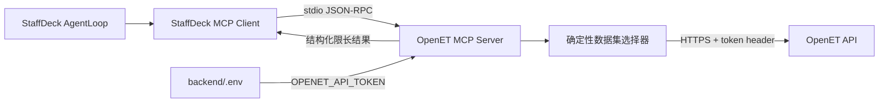

# OpenET MCP 产品需求文档

| 项目 | 内容 |
| --- | --- |
| 文档状态 | Draft / 待实现 |
| 版本 | v1.0 |
| 日期 | 2026-07-31 |
| 目标系统 | StaffDeck 本地部署 |
| MCP 传输方式 | stdio |

## 1. 背景

OpenET（开放数字地球）聚合了常规数值预报、AI 气象预报、集合预报和历史观测数据，并通过 HTTP API 提供单点、多点和区域查询。当前 StaffDeck 已支持 MCP Server 的保存、工具发现、同步和员工绑定，但尚未提供 OpenET 专用 MCP。

本项目将 OpenET API 封装为一个本地 stdio MCP Server，使 StaffDeck 可以发现并按需使用气象数据工具。第一阶段只建设 MCP 能力层，不定义后续 agent 的服务对象、业务职责、提示词或回复风格。

## 2. 产品目标

1. 将当前 OpenET 订阅允许使用的开源数据集封装为结构清晰、可约束的 MCP 工具。
2. 让 StaffDeck 能通过现有 MCP 管理能力保存连接并发现工具，无需新增常驻端口。
3. 对坐标、变量数、时间跨度和返回规模设置明确上限，避免无界查询消耗 API 额度或 agent 上下文。
4. 统一 OpenET 数据和错误格式，使调用方不必理解各数据集的原始响应差异。
5. 默认根据查询类型、时间跨度和业务目标自动选择数据集，同时允许专家显式覆盖。
6. 确保 OpenET token 不进入源码、Git、SQLite、MCP 配置、日志或交接文档。

## 3. 非目标

第一版不包含以下能力：

- 不创建或设计业务 agent。
- 不支持全球地点、离线行政区数据集或本地场站名称映射；中国地点名称由 MCP 内部地理编码解析。
- 不提供 CMA 气象站实况和灾害预警。
- 不提供 TQAI 数据集、ECMWF 商业数据集或其他超出当前订阅的内容。
- 不提供 NetCDF 数据推送、批量导出或长期离线数据仓库。
- 不开放未经聚合的区域网格结果。
- 不新增远程 MCP 服务、HTTP 监听端口、容器或第三方依赖。
- 不自动把工具同步到 StaffDeck 公共工具广场或绑定给任何员工。

## 4. 用户与使用场景

### 4.1 当前用户

- StaffDeck 管理员：配置 OpenET token、保存 MCP 连接并发现工具。
- 后续 agent 设计者：在明确 agent 职责后，从已发现工具中选择所需能力并进行私有绑定。

### 4.2 核心场景

- 查看当前账户可使用的数据集及其能力边界。
- 直接按中国城市、区县等地点名称查询预报；已有坐标的系统也可传经纬度。
- 查询集合预报的均值、最小值或最大值。
- 查询最长 7 天的逐小时历史观测。
- 对最多 5 个坐标执行受控的多点预报查询。
- 对受限矩形区域查询单变量区域平均预报。
- 在普通查询中使用 `dataset=auto`，由 MCP 选择数据集并说明选择原因。
- 在研究、回测或模型比较场景中显式指定数据集，覆盖自动选择结果。

## 5. 权限与数据范围

### 5.1 订阅假设

第一版按以下账户权限实现：

- 版本：基础版或开发者版。
- 范围：OpenET 全域。
- 数据集：仅开源数据集。

这里的“全域”不是全球，固定指：

- 经度：`72 <= lon <= 137`
- 纬度：`17 <= lat <= 55`

所有查询工具必须在调用上游 API 前执行坐标校验。超出范围时直接返回 MCP 参数错误，不消耗 OpenET 查询额度。

### 5.2 首版数据集目录

| 类别 | 数据集 | 查询 key | 典型分辨率 | 最大预测长度或延迟 |
| --- | --- | --- | --- | --- |
| 常规预报 | NOAA GFS | `gfs_surface` | 0.25 度 | 384 小时 |
| AI 预报 | NOAA Graphcast | `gfs_graphcast` | 0.25 度 | 384 小时 |
| 长周期预报 | NOAA CFS 6h | `cfs_h6_surface` | 1 度 | 约 7 个月 |
| 常规预报 | ECMWF IFS Open | `ifs_surface` | 0.25 度 | 240 小时 |
| AI 预报 | ECMWF AIFS | `aifs_surface` | 0.25 度 | 360 小时 |
| 常规预报 | DWD ICON | `icon_surface` | 0.125 度 | 180 小时 |
| 集合预报 | NOAA GEFS P25 | `gefs_p25` | 0.25 度 | 240 小时 |
| 集合预报 | NOAA GEFS P50 | `gefs_p50` | 0.5 度 | 840 小时 |
| 集合预报 | ECMWF ENS Open | `ens_open` | 0.25 度 | 360 小时 |
| 集合预报 | DWD ICON EPS | `iconeps_surface` | 0.25 度 | 180 小时 |
| 历史观测 | ECMWF ERA5 | `era5_surface` | 0.25 度、逐小时 | 约 7 天延迟 |
| 历史观测 | ECMWF ERA5-Land | `era5_land` | 0.1 度、逐小时 | 约 7 天延迟，仅陆地 |
| 历史观测 | NOAA GDAS | `gdas_surface` | 0.25 度、逐小时 | 约 1 天延迟 |

MCP 内的数据集目录必须版本化维护。实际实现前应再次对照 OpenET 官方数据状态和各数据集文档；如果官方状态与本表不一致，以官方当前文档为准，并同步更新本 PRD 或实现附带的目录版本说明。

## 6. 总体方案



### 6.1 部署约束

- MCP Server 运行于 StaffDeck 后端现有 Python 3.11 虚拟环境。
- MCP Server 使用 stdio 与 StaffDeck 通信，不监听 TCP 端口。
- 上游请求使用项目已有 HTTP 客户端能力，不新增 Python 包。
- StaffDeck MCP 连接中的 `headers` 和 `env` 必须为空，不保存 token。
- MCP 进程从工作目录 `E:\TLong\StaffDeck\backend` 下的 `.env` 读取 `OPENET_API_TOKEN`。

### 6.2 计划连接配置

| 字段 | 值 |
| --- | --- |
| 名称 | `openet` |
| 展示名称 | `OpenET 气象数据` |
| Transport | `stdio` |
| Command | `E:\TLong\StaffDeck\backend\.venv\Scripts\python.exe` |
| Args | `-m`、OpenET MCP 服务模块名 |
| CWD | `E:\TLong\StaffDeck\backend` |
| Env JSON | `{}` |
| Headers JSON | `{}` |

模块名由实现阶段按现有后端包结构确定，但不得把 token 作为命令行参数或 stdio 配置参数传递。

### 6.3 数据集自动选择

LLM 不负责记忆所有 OpenET 数据集差异。调用链中的职责固定为：

1. LLM 判断用户需要预报、集合不确定性还是历史数据，并选择对应 MCP 工具。
2. LLM 将时间跨度、变量和可选的 `selection_goal` 传给工具，不必填写具体数据集 key。
3. MCP 使用本地版本化目录和确定性规则选择数据集、校验变量与预测长度。
4. OpenET 返回气象数值，LLM 只负责解释结果。

所有查询工具的 `dataset` 默认值均为 `auto`。调用方可以显式传入数据集 key；显式值通过类别、变量、时段和权限校验后优先于自动规则。

自动选择规则如下：

| 工具类型或目标 | 条件 | 自动选择 |
| --- | --- | --- |
| 普通常规预报 | `selection_goal=general`，默认 | `gfs_surface` |
| AI 预报 | `selection_goal=ai`，预测长度不超过 360 小时 | `aifs_surface` |
| AI 预报 | `selection_goal=ai`，预测长度为 361–384 小时 | `gfs_graphcast` |
| 高空间分辨率预报 | `selection_goal=high_resolution`，预测长度不超过 180 小时 | `icon_surface` |
| 高空间分辨率预报 | `selection_goal=high_resolution`，预测长度超过 180 小时 | 回退到 `gfs_surface`，必须说明 ICON 时长不足 |
| 数月趋势 | `selection_goal=long_range` | `cfs_h6_surface` |
| 集合不确定性 | 预测长度不超过 360 小时 | `ens_open` |
| 延伸期集合趋势 | 预测长度为 361–840 小时 | `gefs_p50` |
| 一般历史数据 | `selection_goal=general` 且结束时间早于当前约 7 天 | `era5_surface` |
| 陆地、土壤或农业历史 | `selection_goal=land` | `era5_land` |
| 最近历史数据 | `selection_goal=recent`，或结束时间处于 ERA5 约 7 天延迟窗口内 | `gdas_surface` |

补充约束：

- 表中的数据集是首选项；若首选项不支持请求变量，常规预报按 `gfs_surface -> ifs_surface -> icon_surface`、AI 预报按 `aifs_surface -> gfs_graphcast`、360 小时内集合预报按 `ens_open -> gefs_p25 -> iconeps_surface` 的顺序寻找第一个同时满足变量和时长的候选。
- 自动选择每次只返回一个数据集，不因“可能更准确”而自动并行调用多个模型。
- 多模型比较必须由 agent 显式发起多个调用，并受后续 agent 的额度策略约束。
- `list_datasets` 和 `describe_dataset` 供专家查询及特殊问题使用，不是普通查询的前置步骤。
- 自动选择结果必须返回 `selected_dataset`、`selection_reason` 和可选的 `alternatives`。
- 如果没有数据集同时满足类别、变量、时长和目标，必须返回选择失败错误，不得静默改变量或缩短请求时段。

## 7. MCP 工具需求

### 7.1 `list_datasets`

列出第一版支持的数据集，不调用 OpenET API，不消耗查询额度。

输入：

| 字段 | 类型 | 必填 | 约束 |
| --- | --- | --- | --- |
| `category` | string | 否 | `forecast`、`ensemble`、`history`；缺省返回全部 |

输出至少包含：`dataset`、`display_name`、`category`、`spatial_resolution`、`temporal_resolution`、`max_horizon_hours` 或 `data_delay`。

### 7.2 `describe_dataset`

返回单个数据集的能力说明，不调用 OpenET API，不消耗查询额度。

输入：

| 字段 | 类型 | 必填 | 约束 |
| --- | --- | --- | --- |
| `dataset` | string | 是 | 必须来自首版数据集目录 |

输出至少包含数据集基础信息、可用变量、默认单位、支持的单位转换、更新频率、时间分辨率、空间分辨率、最大预测长度或数据延迟，以及是否支持多点和区域平均查询。

### 7.3 `get_point_forecast`

按单个中国地点名称或已有坐标查询常规、长周期或 AI 预报。终端用户不需要提供经纬度；地点有歧义时只追问省、市或区县。

| 字段 | 类型 | 必填 | 约束 |
| --- | --- | --- | --- |
| `dataset` | string | 否 | 默认 `auto`；也可显式选择 `forecast` 类数据集 |
| `selection_goal` | string | 否 | `general`、`ai`、`high_resolution`、`long_range`；默认 `general` |
| `location` | string | 条件必填 | 中国城市、区县或地点名称；与 `lon`/`lat` 二选一，面向用户时优先使用 |
| `lon` | number | 条件必填 | `72..137`；仅供已掌握坐标的系统调用，不向终端用户索取 |
| `lat` | number | 条件必填 | `17..55`；仅供已掌握坐标的系统调用，不向终端用户索取 |
| `mete_vars` | string[] | 是 | 1–5 个；必须属于该数据集 |
| `time` | string | 否 | UTC 数值模式起报时间，不是天气目标日期；普通今天/明天/后天查询必须缺省 |
| `timezone` | integer | 否 | `-12..12`，默认 `8`；只影响返回时间，不改变起报时间语义 |
| `horizon_hours` | integer | 否 | 默认 `72`；不得超过数据集最大预测长度 |

结果只保留起始有效时间至 `horizon_hours` 范围内的数据，并返回上游总点数和截断状态。显式指定 `dataset` 时，`selection_goal` 只作为选择原因上下文，不覆盖指定值。

### 7.4 `get_ensemble_forecast`

查询单点集合预报。复用单点预报的地点名称或坐标、变量、起报时间、时区和预测长度参数，但不接受常规预报的 `selection_goal`，并使用以下集合专用参数：

| 字段 | 类型 | 必填 | 约束 |
| --- | --- | --- | --- |
| `dataset` | string | 否 | 默认 `auto`；也可显式选择 `ensemble` 类数据集 |
| `ensemble_set` | string[] | 否 | `mean`、`min`、`max` 的非空无重复子集；默认仅 `mean` |

`dataset=auto` 时根据 `horizon_hours` 选择 `ens_open` 或 `gefs_p50`。不得默认请求全部集合统计量。OpenET 可能按统计量分别计算调用次数，因此默认仅使用 `mean` 以控制额度。

### 7.5 `get_point_history`

查询单点逐小时历史观测。

| 字段 | 类型 | 必填 | 约束 |
| --- | --- | --- | --- |
| `dataset` | string | 否 | 默认 `auto`；也可显式选择 `era5_surface`、`era5_land` 或 `gdas_surface` |
| `selection_goal` | string | 否 | `general`、`land`、`recent`；默认 `general` |
| `location` | string | 条件必填 | 与 `lon`/`lat` 二选一，面向用户时优先使用 |
| `lon` | number | 条件必填 | `72..137`；仅供系统调用 |
| `lat` | number | 条件必填 | `17..55`；仅供系统调用 |
| `mete_vars` | string[] | 是 | 1–5 个；必须属于该数据集 |
| `start_time` | string | 是 | UTC，格式 `YYYY-MM-DD HH:mm:ss` |
| `end_time` | string | 是 | UTC，必须晚于或等于开始时间 |
| `timezone` | integer | 否 | `-12..12`，默认 `8` |

`end_time - start_time` 不得超过 7 天。自动模式根据目标和数据延迟选择 ERA5、ERA5-Land 或 GDAS。结束时间距当前不足约 1 天时，GDAS 也可能尚无数据，此时返回 `NO_DATA`，不得伪造实时观测或自动改查其他日期。ERA5-Land 查询海洋坐标时必须保留并规范化上游“非陆地区域”错误，不得伪造缺失值。

### 7.6 `get_multi_point_forecast`

对多个坐标执行同一数据集、同一起报时刻和同一组变量的预报查询。

| 字段 | 类型 | 必填 | 约束 |
| --- | --- | --- | --- |
| `dataset` | string | 否 | 默认 `auto`；也可显式选择 `forecast` 类数据集 |
| `selection_goal` | string | 否 | `general`、`ai`、`high_resolution`、`long_range`；默认 `general` |
| `points` | number[][] | 是 | 1–5 个 `[lon, lat]`；每个坐标均在全域内 |
| `mete_vars` | string[] | 是 | 1–5 个 |
| `time` | string | 否 | UTC 起报时间；缺省查询最新起报 |
| `timezone` | integer | 否 | `-12..12`，默认 `8` |
| `horizon_hours` | integer | 否 | 默认 `72`；不得超过数据集上限 |

工具必须分别保留请求坐标和上游实际匹配的网格坐标，不能把多个地点的数据合并为一个序列。

### 7.7 `get_area_average_forecast`

查询矩形区域的单变量平均预报。OpenET 官方将区域接口标记为测试能力，因此第一版只允许平均结果。

| 字段 | 类型 | 必填 | 约束 |
| --- | --- | --- | --- |
| `dataset` | string | 否 | 默认 `auto`；显式值必须支持区域查询且属于 `forecast` 类 |
| `selection_goal` | string | 否 | `general`、`ai`、`high_resolution`、`long_range`；默认 `general` |
| `lon_range` | number[2] | 是 | 严格递增，两个端点均在 `72..137` |
| `lat_range` | number[2] | 是 | 严格递增，两个端点均在 `17..55` |
| `mete_var` | string | 是 | 只允许一个变量 |
| `time` | string | 否 | UTC 起报时间；缺省查询最新起报 |
| `timezone` | integer | 否 | `-12..12`，默认 `8` |
| `horizon_hours` | integer | 否 | 默认 `72`；不得超过数据集上限 |

额外约束：

- 经度跨度必须大于 1 度。
- 纬度跨度必须大于 1 度。
- `经度跨度 × 纬度跨度 < 25`。
- 上游请求中的 `avg` 由 MCP 固定为 `true`，不作为公开输入参数。
- 不提供 `avg=false` 或原始区域网格返回通道。

## 8. 统一返回模型

所有调用 OpenET 的查询工具成功时返回统一 JSON object：

```json
{
  "requested_dataset": "auto",
  "selected_dataset": "gfs_surface",
  "selection_reason": "普通 72 小时预报使用默认常规预报数据集",
  "alternatives": ["aifs_surface", "ifs_surface"],
  "query_type": "point_forecast",
  "requested_locations": [[116.4074, 39.9042]],
  "actual_locations": [[116.5, 40.0]],
  "run_time_utc": "2026-07-31 00:00:00",
  "timezone": 8,
  "variables": ["t2m@C", "ws10m"],
  "units": ["C", "m/s"],
  "timestamps": ["2026-07-31 08:00:00"],
  "series": [
    {
      "location": [116.5, 40.0],
      "values": [[29.1, 3.8]]
    }
  ],
  "total_points": 208,
  "returned_points": 1,
  "truncated": true
}
```

要求：

- `requested_dataset` 记录调用方传入的 `auto` 或显式数据集 key。
- `selected_dataset` 记录实际调用 OpenET 的数据集；显式覆盖时也必须返回。
- `selection_reason` 必须使用简洁、可面向用户审计的说明，不输出内部提示词。
- `alternatives` 只提供兼容数据集提示，不触发额外 API 调用。
- `run_time_utc` 对历史观测可以为 `null`。
- 变量顺序、单位顺序和每行值顺序必须一一对应。
- 不执行可能改变专业语义的日聚合、插值、补零或缺失值猜测。
- 只按请求的时间范围或 `horizon_hours` 截断，不改变保留点的值。
- 若上游返回部分变量缺失，必须明确报错或在元数据中列出缺失变量，不能静默改变变量顺序。

## 9. 错误处理

OpenET 业务失败可能仍返回 HTTP 200。MCP 必须同时检查 HTTP 状态、JSON 可解析性以及响应中的 `success`、`code`、`msg`；不能仅以 HTTP 2xx 判断成功。

所有失败通过 MCP 工具结果的 `isError=true` 返回，错误内容为不含敏感信息的结构化 JSON。统一错误代码如下：

| MCP 错误代码 | 场景 |
| --- | --- |
| `VALIDATION_ERROR` | 日期、坐标、变量、数量、时间跨度或区域参数不合法 |
| `AUTH_MISSING` | 本地未配置 `OPENET_API_TOKEN` |
| `AUTH_REJECTED` | OpenET 拒绝 token 或账户无相应权限 |
| `OUT_OF_SCOPE` | 坐标不在订阅范围或数据集不在首版权限内 |
| `NO_DATA` | 指定时间或位置无数据 |
| `VARIABLE_UNAVAILABLE` | 数据集不支持变量或指定时段缺少变量 |
| `DATASET_SELECTION_FAILED` | 自动模式找不到同时满足类别、变量、时长和目标的数据集 |
| `UPSTREAM_TIMEOUT` | OpenET 请求超时 |
| `UPSTREAM_ERROR` | 上游 HTTP 或业务错误 |
| `RESPONSE_INVALID` | 上游响应不是预期 JSON 或结构不完整 |

错误消息可以包含工具名、数据集、OpenET 业务错误码和脱敏后的 `msg`，但不得包含 token、完整请求 header、环境变量或内部堆栈。

第一版不自动重试查询。自动重试可能重复消耗额度；超时或暂时性错误由调用方决定是否再次调用。

## 10. 安全要求

1. token 的唯一配置位置是被 Git 忽略的 `backend/.env`：

   ```dotenv
   OPENET_API_TOKEN=实际值
   ```

2. 可在 `.env.example` 中增加空的 `OPENET_API_TOKEN=` 作为配置说明，但不得写入真实值。
3. MCP Server 自行从 `.env` 加载 token；StaffDeck MCP `Env JSON` 和 `Headers JSON` 保持为空。
4. token 不得通过命令行参数传递，以免出现在进程列表中。
5. stdout 只输出 MCP JSON-RPC 消息，不输出调试信息；stderr 日志不得包含 token 或完整 header。
6. `NEXT_AGENT_HANDOFF.md` 只记录配置键名、连接方式和验证结果，不记录 token。
7. 验收时以只输出命中数量和文件路径的方式扫描数据库、日志及 Git 变更，禁止在终端回显 token 本身。

## 11. 配额与体量保护

- 预报查询最多 5 个变量，默认只返回未来 72 小时。
- 集合预报默认只请求 `mean`，只有调用方明确指定时才增加 `min` 或 `max`。
- 历史查询最多 7 天、5 个变量。
- 多点查询最多 5 个点、5 个变量。
- 区域查询只允许一个变量和 `avg=true`。
- `list_datasets` 与 `describe_dataset` 完全使用本地目录，不访问上游。
- `dataset=auto` 每次只选择一个数据集；不得自动扇出为多模型调用。
- MCP 不提供绕过上述限制的 `raw_request`、任意 URL 或任意 JSON 工具。

OpenET 官方对不同类型查询采用不同的调用次数计算方式。MCP 的限制用于避免明显的大请求，但不承诺准确预测账户最终扣减次数；账户剩余额度仍以 OpenET 版本管理页面为准。

## 12. StaffDeck 接入要求

1. 在 StaffDeck 中创建名为 `openet` 的租户级 MCP Server 配置。
2. 保存连接后执行 `tools/list`，确认 7 个工具均能被发现。
3. 发现阶段不创建或同步 StaffDeck Tool 行。
4. 已保存的 MCP Server 必须显示在员工工具管理页，即使尚未同步 Tool 行或绑定给任何员工；该展示不代表员工已获得调用权限。
5. 在后续 agent PRD 确定前，不向公共工具广场同步，也不绑定给任何现有员工。
6. 后续 agent 只绑定其职责所需的子集；是否开放历史、多点或区域查询由后续 agent 需求决定。
7. 后续 agent 默认只判断查询意图并使用 `dataset=auto`；只有专家模式、回测或明确的模型比较请求才显式指定数据集。

## 13. 验收标准

### 13.1 协议与单元测试

- 覆盖 MCP `initialize`、`notifications/initialized`、`tools/list`、`tools/call`。
- 验证 7 个工具名称、描述和 JSON Schema 与本 PRD 一致。
- 覆盖合法坐标及四个边界值 `72/137/17/55`。
- 覆盖越界坐标、变量为空、超过 5 个变量和未知变量。
- 覆盖历史起止时间倒置及超过 7 天。
- 覆盖多点超过 5 个坐标。
- 覆盖区域边长不合格、面积大于或等于 25，以及尝试请求原始网格。
- 覆盖默认 72 小时截断、数据集最大预测长度限制和 `truncated` 标记。
- 覆盖普通、AI、高分辨率、长周期、集合、近期历史和陆地历史的自动选择规则。
- 覆盖显式数据集优先、类别不匹配、时长不兼容和 `DATASET_SELECTION_FAILED`。
- 验证自动选择单次只产生一个上游请求，并返回选择原因但不调用备选数据集。
- 覆盖 HTTP 200 但 `success=false`、非 JSON 响应、超时和缺少 token。
- 所有自动化测试使用 mock 上游，不消耗真实额度。

### 13.2 真实 API 冒烟测试

在用户已本地配置 token 后，使用全域内单点和最少变量进行真实测试，总消耗控制在约 5 个计费单位以内：

1. 使用 `dataset=auto` 执行单点最新预报：一个变量，并确认选择 `gfs_surface`。
2. 使用 `dataset=auto` 执行单点集合预报：一个变量、仅 `mean`，并核对选择原因。
3. 使用 `dataset=auto` 执行单点历史观测：一个变量、一天，并核对数据延迟路由。

多点和区域能力使用 mock 验证，除非前三项无法覆盖真实响应结构且增加调用仍不会超过约定额度。

### 13.3 StaffDeck 验收

- StaffDeck 能保存 stdio MCP 连接。
- “发现工具”能列出全部 7 个工具及其输入 Schema。
- MCP 配置的 `headers` 和 `env` 为空。
- OpenET 尚未绑定员工时，员工工具管理页仍显示该 MCP Server，并标记当前员工的工具数为 0。
- 验收后 StaffDeck 公共工具广场中没有新增 OpenET Tool 行。
- SQLite、`.dev/logs`、Git diff 和 `NEXT_AGENT_HANDOFF.md` 中均不存在真实 token。
- 相关测试、定向静态检查和 `git diff --check` 通过；如有环境性失败，记录实际命令与错误。

## 14. 发布与回退

### 14.1 发布

1. 合入 MCP Server、测试和空配置示例。
2. 用户在本地 `backend/.env` 添加 token。
3. 重启 StaffDeck，使新配置对 MCP 子进程可见。
4. 保存 MCP 连接并执行发现。
5. 完成真实 API 冒烟测试和敏感信息扫描。

### 14.2 回退

- 从 StaffDeck 删除 `openet` MCP Server 配置。
- 删除或清空本地 `OPENET_API_TOKEN`。
- 回退 MCP Server 代码与空配置示例。
- 若已同步工具，先解除员工私有绑定，再删除 OpenET Tool 行；不要影响其他工具或员工资源。

## 15. 后续阶段

地点名称解析和员工直接工具调用已经作为后续增量落地。仍需继续明确默认地点、允许使用的工具子集、额度预算、回答粒度、风险提示和人工确认规则；这些决策不扩大 OpenET 数据权限。

## 16. 参考资料

- [OpenET 官网](https://openet.terraqt.com/)
- [OpenET API 数据查询（基础）](https://doc.terraqt.com/s/openet/doc/api-3hHyhGZXne)
- [OpenET API 数据查询（进阶）](https://doc.terraqt.com/s/openet/doc/api-fd5kIaz27g)
- [OpenET 数据总览](https://doc.terraqt.com/s/openet/doc/5pww5o2u5oc76kei-2luiF7Vom6)
- [OpenET 版本对比](https://doc.terraqt.com/s/openet/doc/54mi5pys5a55qu-k4AaOClqCD)
- [OpenET 区域与全域说明](https://doc.terraqt.com/s/openet/doc/5yy65zf5lio5ywo5zf-lPicmELAfJ)
- [OpenET 常见错误及解决方式](https://doc.terraqt.com/s/openet/doc/5bi46keb6zsz6kv5yk6kej5yaz5pa55byp-nARzsoUdAi)
