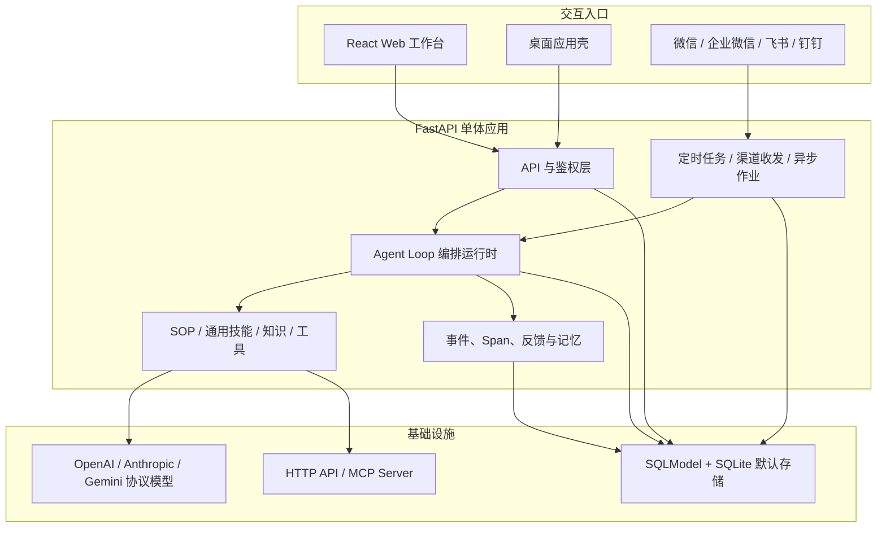
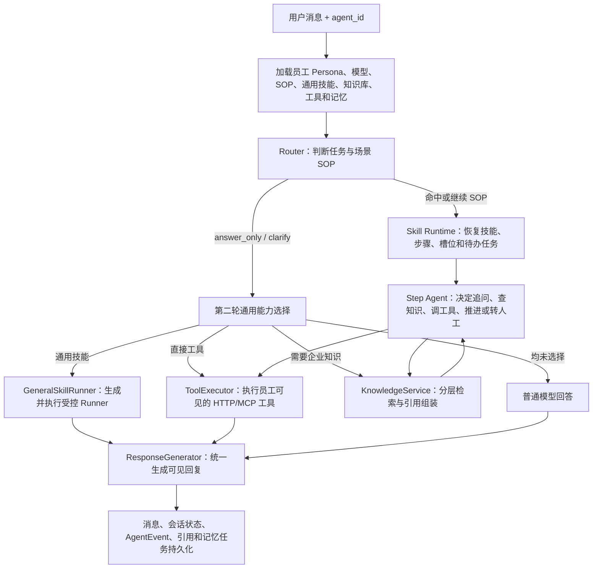
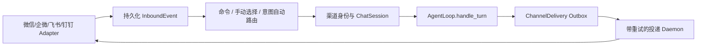

# StaffDeck 项目架构与核心实现讲解

> 本文基于 2026-08-03 当前工作区代码与本机 SQLite 数据整理，目标是先建立系统全貌，再沿核心运行链路深入必要细节。它不是 API 清单，而是一份面向开发者的代码阅读地图。员工绑定属于运行数据，后续调整资源后应重新核对，不能把本文快照当成永久配置。

## 1. 先用一句话理解项目

StaffDeck 是一套“企业数字员工运行平台”：用户为数字员工绑定模型、SOP 技能、通用技能、知识库和外部工具，数字员工通过网页或即时通信渠道接收任务，由 Agent Loop 选择并执行能力，同时持久化会话状态、执行事件、长期记忆、反馈和审计数据。

因此，它不只是一个聊天界面，也不只是一个 RAG 服务。它同时包含五类职责：

1. **数字员工管理**：定义身份、岗位描述、资源范围、模型与发布状态。
2. **Agent 编排执行**：理解用户意图，在多步骤任务、知识查询、工具调用和普通回答之间调度。
3. **企业能力资产化**：管理可版本化的 SOP、通用技能、知识库和工具。
4. **持续运行与治理**：支持定时任务、长期记忆、反馈分析、人工接管和完整执行记录。
5. **多入口交付**：同时服务 Web UI、桌面应用和微信、企业微信、飞书、钉钉等渠道。

## 2. 顶层架构



从部署形态看，这是一个**模块化单体**，而不是微服务系统：绝大多数业务能力都在同一个 Python 进程中，通过清晰的包边界组织；SQLite 是默认数据存储，线程型后台任务负责流式执行、定时调度和渠道收发。

## 3. 仓库目录与职责

| 目录 | 职责 | 建议关注的入口 |
| --- | --- | --- |
| `backend/` | FastAPI API、Agent 运行时、数据模型、后台任务 | `backend/app/main.py` |
| `frontend-enterprise/` | React + TypeScript 企业工作台和聊天界面 | `frontend-enterprise/src/App.tsx` |
| `contracts/agent/v1/` | Agent 行为兼容契约、Schema、黄金样例 | `contracts/agent/v1/manifest.json` |
| `scripts/` | 跨平台开发服务的启动、状态与停止 | `scripts/dev.py` |
| `packaging/` | PyInstaller、安装包、macOS/Linux/Windows 构建 | `packaging/ultrarag.spec` |
| `backend/tests/` | 后端单元、集成、契约与行为回归测试 | `backend/tests/agent_golden/` |

后端内部按业务能力继续拆分：

```text
backend/app/
├── api/                 # HTTP 路由和输入输出边界
├── core/                # Agent Loop、Router、Step Agent、反思与上下文
├── agents/              # 数字员工资源可见性、分支和版本管理
├── capabilities/        # 能力提供者抽象及本地实现
├── knowledge/           # 文档解析、入库、OKF、分层检索、引用
├── skills/              # SOP 技能 Schema、编辑、蒸馏和反思
├── general_skills/      # SKILL.md 包导入与隔离 Runner
├── tools/               # HTTP / MCP 工具执行
├── llm/                 # 模型协议、请求适配、上下文裁剪与 JSON 输出
├── memory/              # 长期记忆提取与召回
├── channels/            # 多 IM 渠道适配、路由、可靠收发
├── scheduled_tasks/     # 定时计划计算、租约和执行 Worker
├── observability/       # AgentEvent 与 LLM/知识 Span
├── security/            # 登录令牌、密码、加密、租户和权限
├── session/             # 会话 Schema、附件和槽位策略
└── db/                  # SQLModel 表、数据库初始化、迁移和种子数据
```

## 4. 进程启动与部署结构

### 4.1 FastAPI 组合根

[`backend/app/main.py`](backend/app/main.py) 是后端的组合根：

1. 创建 FastAPI 应用并配置 CORS。
2. 启动时初始化数据库、执行本地迁移并播种演示数据。
3. 启动定时任务 Worker 和渠道服务。
4. 注册聊天、员工、知识、技能、模型、工具、渠道、会话、追踪等路由。
5. 关闭时依次停止渠道、定时任务和异步作业。

这里刻意关闭了 FastAPI 自带的 OpenAPI、Swagger 和 ReDoc 路由。健康检查位于 `GET /api/health`。

### 4.2 单端口应用

[`backend/single_port_app.py`](backend/single_port_app.py) 在主 FastAPI 应用上继续挂载构建后的 Vite 静态资源，并为 React Router 提供 SPA fallback。最终 Web UI 和 `/api/*` 由同一进程、同一端口提供。

开发脚本 [`scripts/dev.py`](scripts/dev.py) 会先构建前端，再启动这个单端口应用。Vite 自身的开发配置仍支持把 `/api` 代理到后端，但仓库推荐的统一启动路径使用构建产物和单端口 FastAPI 服务。

### 4.3 桌面发行

桌面入口 [`backend/desktop_launcher.py`](backend/desktop_launcher.py) 与 `packaging/` 下的 PyInstaller/安装包脚本共同把 Python 运行时、后端和前端产物组装为桌面应用。`app.paths` 会区分源码运行和 frozen 运行，决定静态资源及用户数据目录。

## 5. 前端架构

前端技术栈是 React 18、TypeScript、React Router、Vite、Tailwind CSS 4，并使用 Radix/shadcn 风格的基础组件和 Lucide 图标。

### 5.1 应用壳与路由

[`frontend-enterprise/src/App.tsx`](frontend-enterprise/src/App.tsx) 承担三个职责：

- 从 `localStorage` 恢复登录令牌，并调用 `/api/auth/me` 复验用户。
- 根据用户是否登录，在登录页、聊天工作区和企业管理后台之间切换。
- 在前端执行角色保护，例如账户和模型配置页面只对管理员开放。

路由主要分成两组：

| 路由前缀 | 用途 |
| --- | --- |
| `/workspace/*` | 数字员工广场、会话与聊天主工作区 |
| `/enterprise/*` | 员工、能力、知识、模型、渠道、账户和运营管理 |

### 5.2 API 访问

[`frontend-enterprise/src/api/client.ts`](frontend-enterprise/src/api/client.ts) 是轻量请求层：

- 自动从本地会话附加 Bearer Token。
- 统一把非 2xx 响应转为 `ApiError`。
- 提供 JSON 请求、附件上传和 SSE 流读取。
- SSE 不是浏览器 `EventSource`，而是 `fetch` POST 后手工解析响应流，因为聊天需要在请求体中提交复杂任务数据。

### 5.3 聊天状态管理

聊天核心集中在 [`frontend-enterprise/src/pages/chat/useChatSession.ts`](frontend-enterprise/src/pages/chat/useChatSession.ts)。这个 Hook 同时管理：

- 会话列表、历史消息与执行记录；
- 当前数字员工和模型；
- 草稿会话、排队消息、附件与取消操作；
- SSE 增量文本和运行阶段；
- 断流后的事件补拉与最终消息对账；
- 定时任务草案、人工接管、反馈和会话标题更新。

页面组件则按显示职责拆分为消息列表、输入器、执行记录、对话框和头部等。换句话说，当前前端属于“**大 Hook 负责状态与副作用，小组件负责展示**”的组织方式。

## 6. 后端分层

后端没有强制套用传统 DDD 目录，但代码实际形成了以下层次：

| 层 | 典型模块 | 主要职责 |
| --- | --- | --- |
| HTTP 边界 | `app/api/*` | 鉴权、租户校验、请求验证、响应与 SSE |
| 应用编排 | `app/core/agent_loop.py` | 协调一次任务所需的全部业务服务 |
| 领域能力 | `core/router.py`、`core/skill_runtime.py`、`knowledge/`、`tools/` | 场景路由、状态迁移、知识和外部动作 |
| 基础设施 | `llm/`、`db/`、`channels/adapters/` | 模型协议、数据库、外部渠道适配 |
| 横切能力 | `security/`、`observability/`、`memory/` | 权限、审计、Span 和长期记忆 |

`AgentLoop` 依赖许多具体实现而非完整的依赖注入容器，说明它仍是务实的模块化单体。`capabilities/` 已开始抽象能力契约和 Provider，但旧链路仍通过 `legacy_*` 适配层保留兼容行为。

## 7. 一次聊天请求的完整链路

```mermaid
sequenceDiagram
    actor User as 用户
    participant UI as React useChatSession
    participant API as POST /api/chat/stream
    participant Worker as 流式工作线程
    participant Loop as AgentLoop
    participant DB as SQLite / AgentEvent
    participant Model as LLM Provider

    User->>UI: 发送消息
    UI->>API: 消息、agent、session、client_turn_id
    API->>Worker: 创建独立数据库会话并启动线程
    Worker->>Loop: handle_turn_stream(request)
    Loop->>DB: 写用户消息与 user_message_received
    Loop->>DB: 读取会话、记忆、员工可见资源
    Loop->>Model: Router 判断任务与目标技能
    Loop->>Model: Step Agent 规划当前动作
    Loop->>DB: 写路由、技能、知识、工具等事件
    Loop->>Model: 生成最终回复流
    Loop->>DB: 持久化增量事件、消息和会话状态
    API-->>UI: 轮询 AgentEvent 并转发 SSE
    UI->>UI: 更新执行记录与增量消息
    Loop->>DB: 异步触发长期记忆提取
    UI->>API: 完成后重拉消息与 Trace 对账
```

这里有一个重要设计：[`backend/app/api/chat.py`](backend/app/api/chat.py) 的流式接口不是简单地把 `AgentLoop` 生成器直接透传给客户端。

它采用“**执行线程 → 事件表 → SSE Relay**”三段式结构：

1. 工作线程使用独立 SQLModel Session 执行 Agent Loop。
2. 运行事件先落入 `agent_events` 表。
3. HTTP 生成器按游标轮询新事件并转成 SSE。
4. 连接空闲时发送心跳；异常退出时补写 interrupted 终态。

直接收益是执行记录、实时界面和断流恢复共享同一个事实来源。代价是实现复杂度和数据库轮询压力高于直接流式透传。

### 7.1 一条消息如何选择具体能力

`AgentLoop` 并不是固定按“知识库 -> 工具 -> 回复”的顺序运行。它先依据当前员工的资源范围和会话状态决定走哪条能力分支：



这里要区分三个“选择者”：

1. **Router** 只选择任务和 SOP，不执行工具，也不直接检索知识。
2. **Step Agent** 只在当前 SOP 节点允许的动作和工具范围内决定下一步。
3. **通用能力选择器** 只在 Router 放弃场景 SOP 后，从当前员工可见的通用技能、直接工具和知识能力中选择；最终执行仍由各自的运行时完成。

因此，同一句“帮我查一下余额”，在人事员工中可能进入“假期余额查询” SOP 并调用 `hr.balance_query`，在没有相关资源的员工 `00` 中则只能退化为普通回答或说明无法办理。员工差异来自资源绑定，不是每个员工各自运行一套程序。

## 8. Agent Loop：系统的核心

[`backend/app/core/agent_loop.py`](backend/app/core/agent_loop.py) 是项目的中心编排器。文件较大，但可以按阶段理解。

### 8.1 准备阶段

`_prepare_turn()` 会：

1. 创建或恢复 `ChatSession`，把状态标为运行中。
2. 持久化用户消息，并用用户消息 ID 作为服务端 `turn_id`。
3. 解析本次请求或员工绑定的模型。
4. 计算该员工当前可见的 SOP、通用技能、知识库和工具。
5. 召回该用户在当前员工范围内的长期记忆。
6. 构造压缩后的会话上下文，必要时生成历史摘要。

`client_turn_id` 由前端或渠道提供，负责幂等与重连关联；`turn_id` 使用已经落库的用户消息 ID，负责把后续事件、回复和 Trace 绑定到同一轮。

### 8.2 Router：决定做什么

[`backend/app/core/router.py`](backend/app/core/router.py) 把当前消息、会话状态、可用技能摘要、对话上下文和长期记忆交给模型，要求返回结构化 `RouterDecision`。

典型决策包括：

- 继续当前任务；
- 开始新的 SOP 任务；
- 切换到待处理任务；
- 请求澄清；
- 直接回答或转交通用能力。

Router 输出不会被无条件信任。代码会校验技能是否真实存在、待办任务 ID 是否有效、目标步骤是否可用，并清理不应由模型凭空生成的槽位。

### 8.3 Skill Runtime：维护任务状态

SOP 技能存储为图结构：`content_json` 中包含节点、边和起始节点。运行中的状态主要落在 `ChatSession`：

| 字段 | 含义 |
| --- | --- |
| `active_skill_id` / `active_step_id` | 当前 SOP 与步骤 |
| `slots_json` | 当前任务收集到的结构化参数和工具结果 |
| `skill_stack_json` | 被暂停、待恢复的技能帧 |
| `pending_tasks_json` | 同一条消息拆出的后续任务 |
| `awaiting_input_json` | 当前等待用户补充的字段 |
| `knowledge_context_json` | 已取得的知识证据 |
| `context_state_json` / `summary` | 历史压缩和上下文状态 |

[`backend/app/core/skill_runtime.py`](backend/app/core/skill_runtime.py) 负责把 Router 决策应用到这些状态上，包括启动、暂停、恢复、合并任务帧和切换步骤。

### 8.4 Step Agent：决定当前步骤怎么执行

[`backend/app/core/step_agent.py`](backend/app/core/step_agent.py) 只关注当前步骤。它接收精简后的 SOP 节点、槽位、Router 决策、知识上下文与可用工具，输出结构化 `StepAgentResult`，例如：

- 向用户追问缺失信息；
- 发起知识查询；
- 调用某个工具及其参数；
- 进入人工接管；
- 结束或推进当前步骤；
- 给最终回复准备结构化草稿。

这形成了两级决策：Router 管“任务和流程”，Step Agent 管“当前节点的具体动作”。

### 8.5 动作循环与反思

同一轮消息可能包含多个动作。Agent Loop 会在配置上限内循环：

1. 执行知识查询或工具调用。
2. 把结果写回槽位和事件日志。
3. 判断结果是否异常或不完整。
4. 必要时让 Reflection Agent 给出重试/改参建议。
5. 重新运行 Step Agent 或工具动作。
6. 根据技能图的边推进到后续节点。

`UIConfig.agent_loop_max_actions` 默认限制一轮中的动作总数，`reflection_max_rounds` 限制反思次数。工具重放还有单独的幂等策略，防止副作用操作在修复循环中被无意重复执行。

### 8.6 回复与收尾

[`backend/app/core/response_generator.py`](backend/app/core/response_generator.py) 根据用户问题、员工 Persona、任务状态、Step 结果、工具结果、知识引用和记忆生成最终文本。

收尾阶段会：

- 持久化 assistant 消息；
- 更新会话的技能、槽位、等待输入和完成状态；
- 记录终态事件；
- 为渠道会话登记出站消息；
- 异步提交长期记忆提取任务。

## 9. 两种“技能”不要混淆

项目中存在两类用途不同的技能。

### 9.1 SOP / 场景技能

数据表是 `Skill`，核心内容是结构化 `content_json`。它是一张有状态的流程图，适合请假、退款、采购等需要收集字段、调用工具、分支判断和多轮推进的业务流程。

它由 Router 选择、Skill Runtime 保存状态、Step Agent 执行节点，并支持：

- 发布状态和版本历史；
- 员工私有分支；
- 从公共版本同步、向公共版本提升、回滚；
- 与工具和知识范围绑定。

### 9.2 通用技能

数据表是 `GeneralSkill`，核心内容是 `skill_markdown` 和随包文件，更接近可导入的 `SKILL.md` 能力包。

[`backend/app/general_skills/runner.py`](backend/app/general_skills/runner.py) 的执行过程是：

1. 模型阅读技能说明，生成 Bash 或 Python Runner。
2. 在临时工作目录恢复技能包文件。
3. 通过子进程执行，限制时间和输出大小。
4. 模型审查执行结果，必要时根据错误修复 Runner 并重试。
5. 最后根据结构化结果生成面向用户的回复。

所以，SOP 是**长期保持状态的业务流程图**，通用技能是**根据说明动态生成并运行代码的能力包**。

## 10. 知识系统

知识系统不是简单的“全文切块后向量检索”。当前代码实现的是**结构感知的 PageIndex/OKF 分层检索**：先定位概念、文档和知识桶，再读取原文证据块。当前实现没有 embedding、向量数据库或独立 reranker。

### 10.1 文件读取

[`backend/app/knowledge/parser.py`](backend/app/knowledge/parser.py) 的 `extract_text()` 按扩展名选择解析器：

| 格式 | 当前处理方式 | 重要限制 |
| --- | --- | --- |
| TXT / Markdown | 依次尝试 UTF-8、UTF-8 BOM、GB18030、Latin-1 解码 | 只保留文本，不解释 Markdown 中的附件 |
| HTML | 优先用 BeautifulSoup 删除 script/style/noscript 后取文本；失败时用标准库 HTMLParser | 页面动态渲染内容不会执行 |
| PDF | 用 `pypdf` 逐页 `extract_text()`，并插入“第 N 页”标题 | 没有 OCR；纯扫描 PDF 会得到空文本，复杂排版的阅读顺序取决于 PDF 文本层 |
| DOCX | 用 `python-docx` 读取段落、标题和表格；失败时回退为直接解析 ZIP/XML | 表格行会被拼成 `单元格 | 单元格`，合并关系、图片和版式不保留 |
| DOC | 识别后直接拒绝 | 必须先转换为 DOCX |

抽取后的文本会统一换行、压缩连续空行并去掉首尾空白；没有可用文本时入库任务失败。

### 10.2 入库、章节与切块

[`backend/app/knowledge/service.py`](backend/app/knowledge/service.py) 的完整入库流程是：

```text
上传文件（Base64 暂存到摄取任务）
  -> 异步线程解析和规范化文本
  -> KnowledgeDocument + document_card + section_tree
  -> 结构 Bucket + 可选的 LLM 任务 Bucket
  -> KnowledgeChunk 原文证据
  -> OKF Concept / PageIndex
  -> 可确认的 SOP、工具或健康告警建议
  -> 清除任务中的 Base64 原文
```

关键参数和含义如下：

| 层级 | 参数 | 当前行为 |
| --- | --- | --- |
| 章节节点 | `SECTION_TARGET_CHARS = 1400` | 有标题时保留标题层级和父子路径；同一章节超过目标长度时续写为多个节点，但共享 `related_section_id` |
| 无结构段落组 | `PARAGRAPH_GROUP_CHARS = 4200` | 无稳定标题时按段落聚合，遇到标题或超过目标长度后换组 |
| Bucket 内容 | `BUCKET_SECTION_CHARS = 6000` | 结构 Bucket 来自章节树；默认模型还可生成跨章节、面向问答/规则/工具/技能发现的任务 Bucket；存入 Bucket 的正文最多保留 6000 字符 |
| 证据 Chunk | `EVIDENCE_CHUNK_CHARS = 900` | 先按空行或行得到段落，再按句末标点拆超长段落，最后才按字符硬切；标题本身不进入证据 Chunk |
| Bucket token 估算 | `len(content) // 2` | 只是中文场景下的粗略显示值，不是 tokenizer 的真实 token 数 |

当前切块没有传统滑动窗口 overlap。代码通过 `related_group_id`、前后 Chunk ID 和同章节邻接窗口保存连续关系：只有一个超长段落被拆成多块时，这些块属于同一 related group；普通独立段落不会因为相邻而被强制复制到多个 Chunk。

持久化关系可以压缩为：

```text
KnowledgeBase / KnowledgeBaseVersion
  -> KnowledgeDocument（文件、文档卡片、章节树）
  -> KnowledgeBucket（结构索引或任务索引）
  -> KnowledgeChunk（可引用原文）
  -> KnowledgeConcept（OKF Wiki 页面、链接和来源引用）
```

每个入库任务用 `KnowledgeIngestJob` 记录阶段、进度、错误和取消状态。摄取提交到进程内 `ThreadPoolExecutor`；取消或失败会标记任务并清理未完成文档资产，但进程退出后该线程队列本身不能像持久消息队列那样恢复执行。

### 10.3 检索与 TopK

聊天中的知识查询先由员工绑定限制知识库范围，再进入以下路径：

1. **OKF 概念召回**：最多加载最近更新的 120 个概念，按概念 ID、类型、标题、描述和前 2400 字正文做词法打分；选择数为 `max(max_buckets, 4)`，默认即 4。
2. **文档路由**：对所有 ready 文档先做本地词法预排序，再把排序结果和其余候选补齐到最多 120 个文档卡片交给 LLM；LLM 最多选择 5 个文档。没有模型或模型调用失败时，回退为词法 Top 5。
3. **Bucket 路由**：加载已选文档的 Bucket，本地预排序后补齐到最多 160 个候选交给 LLM；聊天默认最多选择 4 个 Bucket。没有模型或模型调用失败时，回退为词法 Top 4。
4. **章节展开**：根据 Bucket 关联的 section ID 展开章节及子章节；聊天自动知识查询默认深度 3，SOP 请求可在 1 到 4 之间限制。
5. **Chunk 排序**：读取所选 Bucket 的全部 Chunk，按章节标题、章节路径、Chunk 摘要、正文以及 Bucket 顺序做本地加权匹配；文档、Bucket、Chunk 和证据的最低相关分阈值目前均为 2.0。
6. **直接命中 TopK**：聊天自动知识路径固定 `max_chunks=8`；SOP 自带的 `KnowledgeQuery` 会被限制到 1 至 12。选择时优先让多个已选 Bucket 各至少贡献一个命中，再按总体分数补满。
7. **邻接扩展**：直接命中后补回同一个 related group 的连续 Chunk。单个命中的邻接窗口最多 6 块、合计最多 4800 字符，因此最终 `response.chunks` 和 evidence pack 的数量可能超过直接命中的 TopK 8。
8. **证据与引用**：生成 `evidence_pack`、OKF citation 和来源路径；`ResponseGenerator` 只把当前轮检索结果和引用提示交给最终回答模型，收尾时再压缩引用编号并删除回复中未使用的 citation。

这里的 TopK 不是一个值，而是多个层次的限制：

| 层次 | 默认/上限 | 选择方式 |
| --- | --- | --- |
| OKF Concept | 默认 4 | 本地词法打分 |
| 文档路由候选 | 最多 120 | 词法预排序后补齐 |
| 最终文档 | 最多 5 | LLM 路由；失败时词法排序 |
| Bucket 路由候选 | 最多 160 | 词法预排序后补齐 |
| 最终 Bucket | 默认最多 4 | LLM 路由；失败时词法排序 |
| 直接命中 Chunk | 聊天默认 8，SOP 最多 12 | 本地加权排序 + Bucket 多样性 |
| 单个命中的邻接窗口 | 最多 6 块 / 4800 字符 | 同一 related group 按原文顺序扩展 |

### 10.4 当前没有使用什么

- **没有 embedding**：数据库表没有向量列，入库时不调用 embedding 模型。
- **没有向量数据库**：未使用 FAISS、Chroma、Qdrant、Milvus、pgvector 等组件。
- **没有独立 reranker**：Chunk 阶段只有本地字符串匹配和加权排序。LLM 只在文档和 Bucket 层返回候选 ID，它是结构路由器，不是对 Chunk 做相关性打分的 cross-encoder reranker。
- **没有真正的检索 token 总预算**：`KnowledgeSearchRequest` 虽然声明 `budget_tokens=4000`，当前 `KnowledgeService._search()` 没有读取或执行它。
- **没有多轮 Bucket 预算控制**：`max_bucket_rounds=2` 目前同样只是请求字段，检索代码只执行一轮 Bucket 路由。

这套方案的优势是结构和来源可解释，且模型路由失败时仍可降级；不足是同义词、语义改写和跨语言问题的召回依赖 LLM 文档/Bucket 路由及有限的字符匹配，数据规模增大后还会面临全量候选读取和上下文成本问题。

## 11. 工具与 MCP

[`backend/app/tools/tool_executor.py`](backend/app/tools/tool_executor.py) 提供统一的 `ToolCall → ToolResult` 边界。

执行前依次校验：

1. 工具是否存在且启用；
2. 是否对当前数字员工可见；
3. 当前 SOP 是否被允许调用该工具；
4. 超时设置是否合法。

HTTP 工具支持 GET 查询参数或其他方法的 JSON Body；Header 和 Bearer Token 中可通过 `${secret.ENV_NAME}` 引用环境变量。

MCP 工具通过 `MCPServer` 配置，支持：

- `streamable_http`
- `sse`
- `stdio`
- 内置演示 Server

工具调用结果被结构化保存到槽位和执行事件中。对于可能产生副作用的工具，Agent Loop 会根据工具幂等配置和历史调用签名决定是否允许自动重放。

## 12. 模型适配层

模型配置由 `ModelConfig` 持久化，API Key 加密存储。当前明确支持三类协议：

- OpenAI Chat Completions
- Anthropic Messages
- Gemini Generate Content

[`backend/app/llm/protocol_drivers.py`](backend/app/llm/protocol_drivers.py) 负责把统一请求翻译成各协议格式；[`backend/app/llm/client.py`](backend/app/llm/client.py) 负责：

- 文本与流式生成；
- 强约束 JSON 输出及兼容性修复；
- thinking/reasoning 参数；
- 请求上下文裁剪与 token 预算；
- 空响应、协议错误和重试诊断；
- 记录模型调用 Span 和使用量。

模型配置带验证状态、配置版本和指纹。运行时通过快照读取配置，避免执行过程中数据库配置被修改后造成前后不一致。

## 13. 数据模型的核心关系

所有主表定义在 [`backend/app/db/models.py`](backend/app/db/models.py)，可以按领域分组理解：

| 领域 | 主要表 | 关系重点 |
| --- | --- | --- |
| 租户与用户 | `Tenant`、`User`、`UserAvatar` | 所有企业数据以 `tenant_id` 隔离 |
| 数字员工 | `AgentProfile`、`AgentUsage` | 员工有 Persona、所有者、发布和使用记录 |
| 能力绑定 | `AgentResourceBinding`、`AgentModelBinding` | 员工对技能、知识、工具和模型的可见范围 |
| SOP | `Skill`、`SkillVersion`、`AgentSkillBranch*` | 公共版本与员工私有分支 |
| 知识 | `KnowledgeBase*`、`KnowledgeDocument`、`KnowledgeBucket`、`KnowledgeChunk`、`KnowledgeConcept` | 从库到文档、结构索引、原文证据和概念 |
| 工具 | `Tool`、`MCPServer` | HTTP/MCP 定义与发现结果 |
| 对话 | `ChatSession`、`Message`、`AgentEvent` | 状态、可见消息和细粒度执行事实分开保存 |
| 长期运营 | `MemoryRecord`、`MessageFeedback`、`SkillFeedback` | 记忆和改进信号 |
| 持续任务 | `ScheduledTask`、`ScheduledTaskRun` | 计划、租约、执行实例与结果 |
| 渠道 | `ChannelBinding*`、`ChannelIdentity`、`ChannelInboundEvent`、`ChannelDelivery` | 账号、身份、入站幂等与出站重试 |

数据库默认是 SQLite。启动时启用 WAL 和 30 秒 busy timeout，以缓解 Web 请求、Agent 工作线程和后台 Worker 的并发写入。迁移逻辑目前是代码内的 SQLite 增量迁移，而不是 Alembic。

## 14. 数字员工的资源隔离与版本分支

[`backend/app/agents/branching.py`](backend/app/agents/branching.py) 是理解企业资源治理的关键。

资源不只是简单的多对多绑定，而是区分：

- 公共广场资源；
- 某个员工的私有资源；
- 从公共版本派生、随后独立演进的员工分支；
- 可同步、已分叉、可提升和可回滚的版本状态。

Agent Loop 获取能力时统一通过可见性函数筛选，不直接查询所有已发布资源。这样，同一个租户内不同数字员工可以有不同的 SOP、知识、工具和模型组合，同时保留公共资产的复用能力。

### 14.1 当前员工能力矩阵

下表来自 2026-08-03 对 `backend/skill_agent_loop.db` 的只读查询。员工是 `AgentProfile` 配置，不是独立进程；`agent_id` 决定 Persona、模型、资源可见性和记忆隔离范围。

| 员工 | 定位 | 知识库 | SOP / 场景技能 | 通用技能 | 可执行工具 |
| --- | --- | --- | --- | --- | --- |
| 财务 | 报销、差旅、预算和发票服务 | 报销政策手册、发票与单据规范、报销办理流程 | 报销额度查询、超标报销特批、差旅报销申请 | 票据字段提取、数据统计分析 | `expense.submit`、`expense.quota_query`、`invoice.verify` |
| 法务 | 合同审查、条款风险与合规咨询 | 历史条款判例库、企业合规制度、合同审查标准、高风险条款指南 | 合同条款风险审查、合作方入库尽调、条款修改建议 | 合同条款提取 | `contract.archive_query` |
| 人事 | 假期、考勤、社保、公积金、薪酬福利和证明服务 | 薪酬福利与证明、社保公积金、员工手册与假期政策 | 加班调休、在职证明、假期余额、请假申请 | 数据统计分析、证明文书生成 | `hr.leave_apply`、`hr.cert_issue`、`hr.balance_query` |
| IT | 权限、设备和故障支持 | IT 服务目录与权限、常见故障排查 | 权限开通工单分流、故障报修受理 | 日志分析、文本翻译、诊断脚本执行 | `it.grant_permission`、`it.ticket_create` |
| 行政 | 会议室、办公用品和用章事务 | 会议室与用章规定、行政服务手册 | 会议室预订、办公用品申领、用章申请审批 | 数据统计分析 | `admin.room_book`、`admin.supply_request` |
| 整体智能体 | 全局资源池和公共资源治理入口 | 当前 14 个业务知识库 | 当前 20 个已绑定 SOP，含业务示例和电商演示流程 | 当前 9 条绑定记录 | 当前 16 个业务/演示 HTTP 工具；不含 OpenET |
| `00` | 本机自建空白员工 | 无 | 无 | 无 | 无；只能使用模型的普通对话能力 |
| `11` | 本机自建测试员工，描述为“到底” | 无 | 无 | 无 | 7 个 OpenET MCP 工具 |

当前数据库中，OpenET 的 7 个工具已经从“人事”解绑，改为绑定给 `11`：`list_datasets`、`describe_dataset`、单点预报、集合预报、历史查询、多点预报和区域平均预报。旧交接文档中的“绑定给人事”是历史状态，解释当前行为时应以数据库为准。

五个内置业务员工的 HTTP 工具当前都指向 `/api/mock/...` 演示接口。这证明 AgentLoop、权限、参数、HTTP 调用和回复链能够跑通，但不代表已连接真实 HR、财务、法务、IT 或行政系统；生产接入仍需替换 URL、鉴权、输入输出 Schema、幂等规则、审计和错误策略。

### 14.2 五个业务员工如何跑通

下面不是产品文案，而是按当前 SOP 节点和绑定资源整理的典型执行链：

1. **人事请假**：Router 命中“请假申请办理” -> 收集工号、假期类型、起止日期和原因 -> `knowledge_query` 节点强制查询假期政策 -> `hr.balance_query` 查余额 -> Step Agent 判断是否符合条件 -> 用户确认 -> `hr.leave_apply` 提交 -> 回复结果或转 HR。
2. **财务差旅报销**：Router 命中“差旅报销申请” -> 收集报销信息 -> 查询差旅补助标准 -> 判断是否超标 -> 收集发票 -> 正常情况调用 `expense.submit`，超标则进入人工审批 -> 返回结果。`invoice.verify` 和票据字段提取属于该员工可见能力，但是否执行取决于命中的 SOP 节点或通用能力选择。
3. **法务合同审查**：Router 命中“合同条款风险审查” -> 收集合同类型和正文 -> 查询审查标准知识 -> `contract.archive_query` 检索历史判例 -> 判断风险级别 -> 输出审查报告；高风险或无先例时转法务专员。
4. **IT 权限/故障**：权限请求进入“权限开通工单分流”，先收集系统和权限等级，普通权限确认后调用 `it.grant_permission`，管理员级权限可转主管；故障请求进入“故障报修受理”，收集现象和影响范围，无法自助解决时调用 `it.ticket_create`。
5. **行政事务**：会议室请求收集日期、时间、人数和工号，确认后调用 `admin.room_book`；用品申领按规则判断是否需审批，再调用 `admin.supply_request`；用章申请先检索用章规定，合规判断后转普通或重要审批，当前没有自动盖章工具。

OpenET 员工 `11` 走的是另一条分支：Router 没有可用 SOP，第二轮通用能力选择器从 7 个可见工具中选择具体工具，`ToolExecutor` 经本地 stdio MCP 调用 OpenET 服务；如果参数使用地点名称，MCP 内部才会调用 Nominatim 解析坐标，之后由确定性规则选择 `dataset=auto` 的具体数据集。Nominatim 不是 LLM 可见工具。

## 15. 鉴权、多租户与权限

Web 登录使用自定义 Bearer Token：

- 密码使用 PBKDF2-SHA256 加随机盐保存；
- Token Payload 含租户、用户和过期时间；
- Token 用 `APP_SECRET` 做 HMAC-SHA256 签名；
- 默认有效期为 14 天。

每个受保护 API 都先根据 Token 还原用户，再校验请求中的 `tenant_id` 必须与用户一致。员工、资源、渠道和会话读取还会继续检查管理员、创建者、所有者或发布可见性。

模型 API Key 和渠道凭据使用加密模块保存。生产环境中 `APP_SECRET` 和可选 `CHANNEL_SECRET` 必须替换默认值。

## 16. 渠道接入架构

`backend/app/channels/` 把不同 IM 协议适配到统一的 `ChannelInbound` / 出站投递模型。



关键可靠性设计包括：

- 外部事件 ID 去重，避免重复入站；
- 同一渠道会话加锁，维持消息顺序；
- 进程代际标记和 stale claim 恢复，处理崩溃中的事件；
- Outbox 持久化出站消息，按退避策略重试；
- 渠道身份可通过一次性绑定码合并到已有 Web 用户；
- 多员工挂载支持命令切换和模型意图自动路由；
- 会话记录保存渠道绑定和外部账号稳定键，防止绑定重建后错误认领历史。

渠道最终仍调用同一个 `AgentLoop`，所以 Web 和 IM 共享数字员工能力、会话模型、记忆与审计链路。

## 17. 定时任务、记忆、反馈与可观测性

### 17.1 定时任务

`ScheduledTask` 保存时区、计划结构、下一次运行时间、并发策略、错过执行策略和租约。后台 Worker 周期性领取到期任务，用租约避免重复执行，再创建独立 `ScheduledTaskRun` 并调用 Agent Loop。

聊天界面也能把自然语言请求解析为“定时任务草案”，但只有用户确认后才创建正式任务。

### 17.2 长期记忆

一次对话完成后，Agent Loop 把用户消息、回复、步骤和工具结果提交到异步记忆任务。记忆按租户、用户和员工范围保存；下一轮在 Router 前召回，作为决策与回复上下文，而不是直接混入所有历史消息。

### 17.3 反馈

消息赞踩保存在 `MessageFeedback`，如果回复发生在 SOP 中，还会建立 `SkillFeedback`，关联具体技能版本和步骤。反馈分析任务进一步写入问题分类、原因、摘要和置信度。

### 17.4 可观测性

系统有两个互补层次：

- `AgentEvent`：面向业务语义的事实流，例如收到消息、路由决策、知识查询、工具调用、反思、回复和终态。
- Span：面向性能和模型调用的细粒度指标，例如 LLM 阶段、候选数量、token 使用和检索耗时。

前端“执行记录”主要由持久化事件投影而来，而不是依赖临时日志文本。

## 18. 契约与测试策略

仓库当前有大量后端测试文件，覆盖 Agent Loop、模型协议、知识、工具、权限、定时任务、渠道可靠性、桌面打包和开发脚本。前端测试数量明显更少，主要覆盖部分工具函数和局部组件。

`contracts/agent/v1/` 不是普通文档目录，而是 Agent 行为兼容层：

- JSON Schema 定义多种行为平面；
- 黄金 Fixture 同时记录 conversation、domain、provider、SSE 和 DB events；
- requirement registry、compatibility matrix 和 pairwise manifest 描述兼容要求；
- `backend/tests/agent_golden/` 对这些契约做验证和回放。

这说明项目将“Agent 行为是否保持兼容”视为跨多个观察面的契约，而不是只比较最终回复字符串。

## 19. 代码中的关键设计取舍

### 19.1 值得保留的设计

- **状态落库而不是只放内存**：SOP 可跨多轮、重连和渠道继续。
- **事件表是流式 UI 与审计的共同事实来源**：便于恢复和追踪。
- **员工资源可见性集中计算**：减少越权读取的机会。
- **知识查询有结构路由和词法回退**：模型不可用时仍有降级路径。
- **模型协议有驱动层**：业务运行时不直接耦合单一 SDK。
- **渠道采用 durable inbox/outbox**：把外部网络不可靠性隔离在适配层。

### 19.2 阅读时要注意的复杂点

- `agent_loop.py` 和 `api/chat.py` 都很大，承担了较多编排及兼容逻辑。
- `legacy_*` 模块说明运行时正在演进，不能仅凭名字判断它们已废弃；它们仍被主链引用。
- SQLite 内迁移代码较长，增加表结构演进的维护成本。
- 前端 `useChatSession.ts` 集中了大量异步状态与恢复逻辑，修改时应重点防范竞态和重复事件。
- 通用技能会运行模型生成的本地代码，虽然有超时、临时目录和运行环境控制，部署方仍应把它视为高风险执行边界。

这些不是简单的“好或坏”，而是当前模块化单体为了兼容性、可恢复性和快速交付付出的复杂度成本。

### 19.3 当前实现与生产级方案的差距

| 领域 | 当前实现 | 生产化时需要补齐 |
| --- | --- | --- |
| 知识召回 | LLM 文档/Bucket 路由 + 本地字符匹配 | embedding 召回、混合检索、独立 reranker、离线评测集和召回/排序指标 |
| 检索预算 | 有 `budget_tokens`、`max_bucket_rounds` 字段但未执行 | 真实 tokenizer 预算、分层截断、候选动态配额和超预算 Trace |
| 检索规模 | ready 文档和所选 Bucket 的 Chunk 从 SQLite 读取后排序 | 可扩展索引、增量更新、分页/过滤、缓存和并发容量评估 |
| 文档解析 | pypdf 文本层、DOCX 段落和扁平表格 | OCR、版面分析、表格结构、图片/附件、解析质量检测和人工纠错 |
| 后台任务 | 进程内线程池，任务状态部分落库 | 可恢复任务队列、租约、重试、幂等和进程重启后的续跑 |
| 业务工具 | 示例员工调用 Mock HTTP API | 真实系统鉴权、网络边界、凭据轮换、幂等键、审批约束、审计和回滚 |
| 配置一致性 | 员工能力绑定存于运行数据库，文档是时间点快照 | 自动导出能力清单、配置变更审计、文档生成或漂移检测 |

代码注释中出现“向量检索”等概括性文字时，应继续检查实际依赖、表字段和调用链，不能仅凭注释认定功能已实现。当前知识专项测试证明结构入库、词法回退、邻接扩展和 citation 行为可用，但不等于已经具备生产级 RAG 的语义召回质量。

## 20. 推荐的源码阅读顺序

如果准备继续深入，建议按以下顺序阅读：

1. [`backend/app/main.py`](backend/app/main.py)：理解进程里有哪些服务。
2. [`frontend-enterprise/src/App.tsx`](frontend-enterprise/src/App.tsx)：理解产品页面和用户入口。
3. [`frontend-enterprise/src/api/client.ts`](frontend-enterprise/src/api/client.ts)：理解 HTTP/SSE 边界。
4. [`backend/app/api/chat.py`](backend/app/api/chat.py)：理解流式请求和事件 Relay。
5. [`backend/app/core/agent_loop.py`](backend/app/core/agent_loop.py)：理解一次任务的总编排。
6. [`backend/app/core/router.py`](backend/app/core/router.py) 与 [`backend/app/core/step_agent.py`](backend/app/core/step_agent.py)：理解两级模型决策。
7. [`backend/app/core/skill_runtime.py`](backend/app/core/skill_runtime.py)：理解 SOP 状态如何跨轮保存。
8. [`backend/app/db/models.py`](backend/app/db/models.py)：把运行状态和持久化结构对应起来。
9. 根据关注方向选读 `knowledge/`、`tools/`、`general_skills/` 或 `channels/`。
10. 最后阅读 `contracts/agent/v1/` 和 `backend/tests/agent_golden/`，理解哪些行为被视为不可随意改变的兼容契约。

## 21. 总结

StaffDeck 的主干可以压缩成下面这条链：

```text
用户/渠道消息
  → 认证与员工资源范围
  → 会话、记忆和上下文投影
  → Router 选择任务/SOP
  → Skill Runtime 更新状态
  → Step Agent 决定当前动作
  → 知识 / HTTP / MCP / 通用技能 / 人工接管
  → 反思与有限重试
  → 回复生成
  → 消息、状态、事件、反馈和记忆持久化
```

理解这个项目最重要的不是记住每个 API，而是抓住三个中心：

1. `ChatSession` 是可恢复的任务状态容器；
2. `AgentLoop` 是所有能力的编排中心；
3. `AgentEvent` 是实时展示、审计和恢复的事实流。

围绕这三个中心，再分别理解员工资源治理、知识、工具、通用技能和渠道，整个代码库就会从“文件很多”变成一套相互连接但边界明确的系统。
